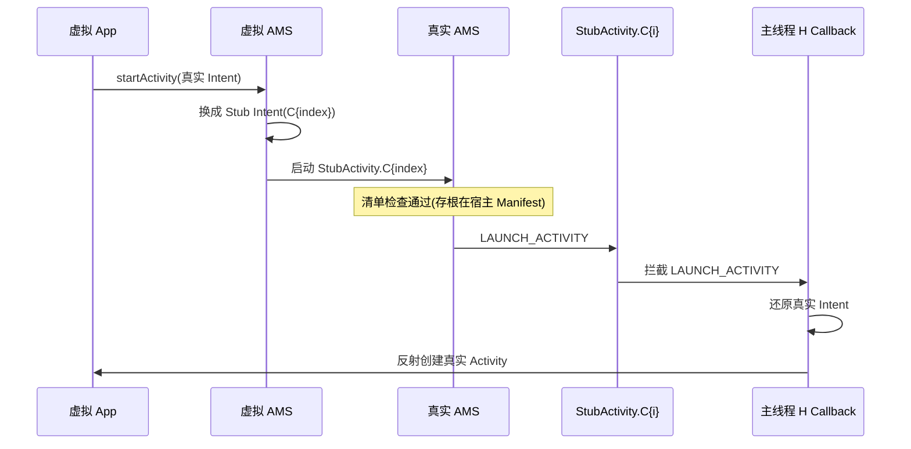

# StubActivity · 占位 Activity 族

::: tip 源码路径
[`src/main/java/com/lody/virtual/client/stub/StubActivity.java`](https://github.com/android-security-engineer/VirtualXposed-skills/blob/vxp/VirtualApp/lib/src/main/java/com/lody/virtual/client/stub/StubActivity.java)
:::

`StubActivity` 是欺骗真实 AMS 清单检查的占位 Activity。它在宿主 Manifest 里预声明了 **N 个内部子类**（`C0`~`CN`），真实系统看到的是这些合法的宿主组件，运行时再用 H Callback 把 Intent 还原成虚拟 App 的真实 Activity。

## 为什么要 100 个存根

真实 AMS 启动 Activity 前会检查「目标组件是否在调用方 Manifest」。虚拟 App 的 Activity 不在宿主 Manifest 里，直接 `startActivity` 会被拒。解法：

1. 虚拟 AMS 把真实 Intent 换成指向 `StubActivity.C{index}` 的 Stub Intent。
2. `StubActivity.C{index}` 在宿主 Manifest 里声明过，AMS 清单检查通过。
3. 真实 AMS 启动 `StubActivity.C{index}`。
4. 主线程 H Callback 拦到 `LAUNCH_ACTIVITY`，把 Stub Intent 还原成真实 Intent，反射创建真实 Activity。

存根数量（`STUB_COUNT`，默认 50）要够容纳并发任务栈，每个并发 Activity 占一个槽位，避免复用冲突。
## Stub Activity 启动与还原

## 变体

`StubActivity` 是抽象基类，子类 `C0`~`CN` 只是占位（空实现）。还有几个语义变体：

| 类 | 语义 |
| --- | --- |
| [`StubDialog`](./stub-dialog) | Dialog 风格存根（透明/弹窗主题） |
| [`StubExcludeFromRecentActivity`](./stub-exclude-recent) | 不进最近任务列表的存根 |
| [`StubPendingActivity`](./stub-pending) | PendingIntent 用的存根 |

## onCreate

`StubActivity.onCreate` 本身不创建 UI——真正的 Activity 创建发生在 H Callback 里。Stub 只是把启动信号传出去。

## 关联

- [Stub Activity 机制](../../features/stub-activity)：完整原理。
- [`VASettings`](./va-settings)：`STUB_COUNT`、`getStubActivityName(index)`。
- [`H Callback` 还原](./hook-delegate)：Intent 还原发生处。
