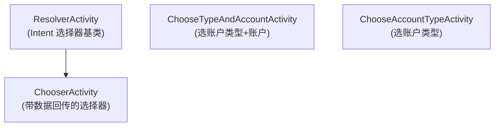

# Chooser / Resolver · 选择器存根

::: tip 源码路径
`stub/ResolverActivity.java` · `ChooserActivity.java` · `ChooseTypeAndAccountActivity.java` · `ChooseAccountTypeActivity.java`（[目录](https://github.com/android-security-engineer/VirtualXposed-skills/tree/vxp/VirtualApp/lib/src/main/java/com/lody/virtual/client/stub)）
:::

这四个存根是系统选择器（Intent 选择 / 账户选择）在虚拟环境下的替代实现。虚拟 App 触发 `createChooser`、`newChooseAccountIntent` 时，真实系统的选择器会暴露宿主身份或路由错误，VirtualXposed 用自己的存根重放这些交互。

## 类族



| 类 | 作用 |
| --- | --- |
| `ResolverActivity` | 处理隐式 Intent 多目标选择（系统 `ResolverActivity` 的虚拟版） |
| `ChooserActivity` | `ChooserActivity extends ResolverActivity`，支持带 extra 数据回传，`EXTRA_DATA`/`EXTRA_WHO`/`EXTRA_REQUEST_CODE` 携带虚拟上下文 |
| `ChooseTypeAndAccountActivity` | 选账户类型再选账户（AOSP 同名 Activity 虚拟版） |
| `ChooseAccountTypeActivity` | 选账户类型，自带 `AccountArrayAdapter` 列表 UI |

## ChooserActivity 的虚拟 extra

```java
public static final String EXTRA_DATA = "android.intent.extra.virtual.data";
public static final String EXTRA_WHO = "android.intent.extra.virtual.who";
public static final String EXTRA_REQUEST_CODE = "android.intent.extra.virtual.request_code";
```

这些 extra 把虚拟 App 的调用上下文（谁发起、原始 requestCode）带进选择器，选择完成后回传，确保 `onActivityResult` 路由正确。`check(Intent)` 判断一个 Intent 是不是虚拟 chooser 请求。

## 关联

- [`account` 代理](../proxies/account)：账户选择触发方。
- [`am` 代理](../proxies/am)：`createChooser` 拦截。
- [Stub Activity 机制](../../features/stub-activity)。
