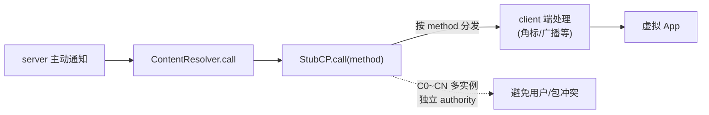

# StubCP · 占位 ContentProvider

::: tip 源码路径
[`src/main/java/com/lody/virtual/client/stub/StubCP.java`](https://github.com/android-security-engineer/VirtualXposed-skills/blob/vxp/VirtualApp/lib/src/main/java/com/lody/virtual/client/stub/StubCP.java)
:::

`StubCP` 是客户端侧的占位 ContentProvider，和 server 端的 [`BinderProvider`](../server/ipc) 配对。它在宿主 Manifest 里声明（`C0`~`CN` 多个实例），是 server **反向调用 client** 的入口通道。

## 为什么需要它

VirtualXposed 的 IPC 主通道是 client → server（client 取服务 binder）。但有时 server 要主动通知 client（如角标更新、广播投递），需要反向通道。`StubCP` 就是这个反向入口：server 通过 `ContentResolver.call` 调用 client 侧的 `StubCP.call(method)`，触发 client 端逻辑。

## call 方法

```java
public Bundle call(String method, String arg, Bundle extras)
```

按 `method` 名分发到不同的 client 端处理逻辑（角标、广播等）。其他 CRUD 方法（`query`/`insert`/`update`/`delete`）一般空实现，因为它只做 `call` 通道。
## 反向 IPC 通道




## 多实例 C0~CN

和 StubActivity 一样，`StubCP` 也有 `C0`~`CN` 多个子类实例，每个有独立 authority（`virtual_stub_N`），对应不同虚拟用户/包，避免冲突。

## VASettings 关联

`VASettings.STUB_DEF_AUTHORITY = "virtual_stub_"` 是 authority 前缀，`getStubAuthority(index)` / `getStubCP(index)` 按索引生成对应类名和 authority。

## 关联

- [`BinderProvider`](../server/ipc)：正向通道（client→server）。
- [`BadgerInfo`](../remote/badger-info)：角标反向通知的载荷。
- [`VASettings`](./va-settings)：authority 配置。
- [IPC 桥](../../features/ipc-bridge)。
