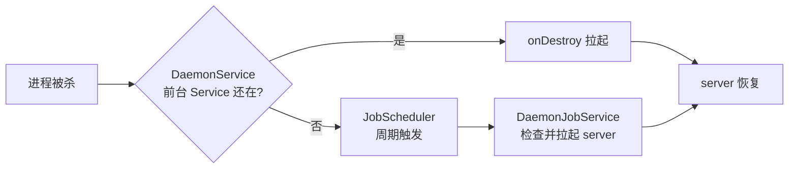

# Daemon 保活机制

::: tip 源码路径
[`src/main/java/com/lody/virtual/client/stub/DaemonService.java`](https://github.com/android-security-engineer/VirtualXposed-skills/blob/vxp/VirtualApp/lib/src/main/java/com/lody/virtual/client/stub/DaemonService.java) + `DaemonJobService.java`
:::

`DaemonService` 与 `DaemonJobService` 配合保活 server 进程。Android 后台进程容易被系统回收，一旦 server 挂了，所有虚拟 App 的 binder 调用都断。这两个组件用「前台 Service + JobScheduler」双保险把 server 拉起来。

## DaemonService

| 成员 | 作用 |
| --- | --- |
| `startup(Context)` | 启动守护 Service |
| `onStartCommand(...)` | 设为前台 Service（带通知） |
| `InnerService` | 内部 Service，进一步提优先级 |
| `showNotification` | 是否显示保活通知（`NOTIFY_ID=1001`） |
| `onDestroy()` | 被杀时重新拉起 |

前台 Service 让进程优先级提到「前台」级别，降低被低内存杀手回收的概率。

## DaemonJobService

| 成员 | 作用 |
| --- | --- |
| `scheduleJob(Context)` | 用 `JobScheduler` 注册周期任务 |
| `onStartJob(...)` | 周期触发，检查 server 是否存活，不在则拉起 |
| `onStopJob(...)` | 返回 true 让任务重新调度 |

JobScheduler 在系统空闲时仍能周期唤醒，作为 Service 被杀后的兜底拉起手段。

## 双保险逻辑

## 关联

- [`VASettings`](./va-settings)：保活相关开关。
- [进程模型](../../architecture/process-model)：server 进程地位。
- [IPC 桥](../../features/ipc-bridge)：为什么 server 不能挂。
