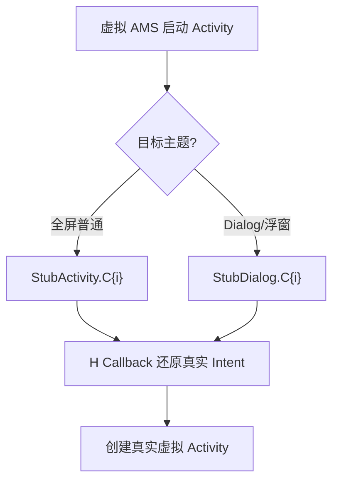

# StubDialog · Dialog 风格存根

::: tip 源码路径
[`src/main/java/com/lody/virtual/client/stub/StubDialog.java`](https://github.com/android-security-engineer/VirtualXposed-skills/blob/vxp/VirtualApp/lib/src/main/java/com/lody/virtual/client/stub/StubDialog.java)
:::

`StubDialog` 是 [`StubActivity`](./stub-activity-family) 的 Dialog 主题变体。当虚拟 App 启动一个带 Dialog 主题（透明、浮窗）的 Activity 时，真实系统对 Dialog Activity 的窗口处理和普通 Activity 不同，需要专门的存根槽位承载。

## 与 StubActivity 的关系

`StubDialog` 同样预声明 `C0`~`CN` 多个子类挂在宿主 Manifest，机制和 `StubActivity` 一致——欺骗清单检查、H Callback 还原真实 Intent。区别只在主题：`StubDialog` 用 Dialog 主题，让弹出的虚拟 Activity 视觉上是浮窗。

## 何时选用

虚拟 AMS 启动 Activity 时，按目标 Activity 的主题决定用 `StubActivity` 还是 `StubDialog`：Dialog 主题的走 `StubDialog`，普通全屏走 `StubActivity`。`VASettings.getStubDialogName(index)` 生成对应类名。
## 存根主题路由

## 关联

- [`StubActivity` 族](./stub-activity-family)：基类机制。
- [`VASettings`](./va-settings)：类名生成。
- [Stub Activity 机制](../../features/stub-activity)。
