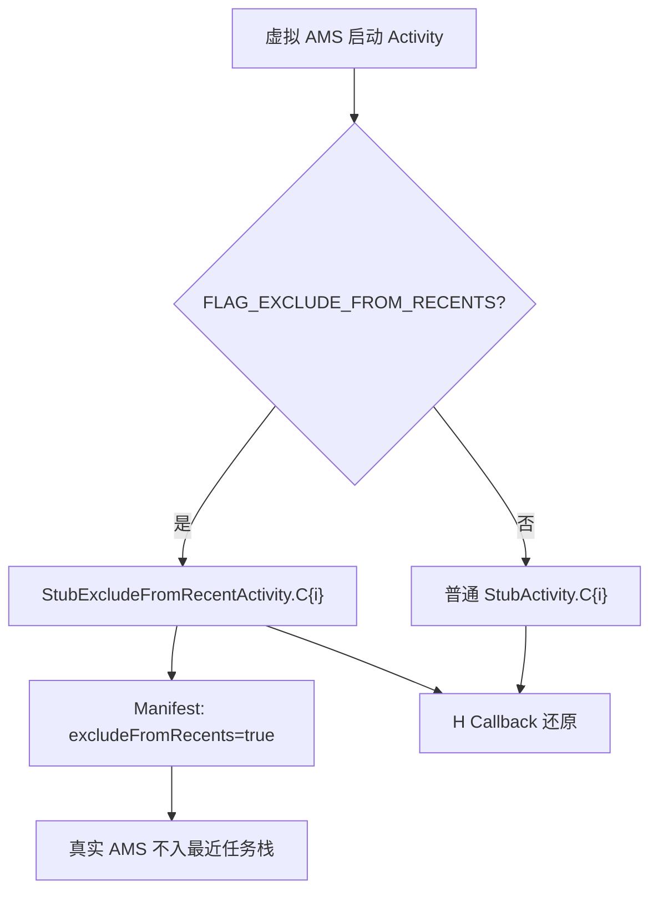

# StubExcludeFromRecentActivity · 不进最近任务的存根

::: tip 源码路径
[`src/main/java/com/lody/virtual/client/stub/StubExcludeFromRecentActivity.java`](https://github.com/android-security-engineer/VirtualXposed-skills/blob/vxp/VirtualApp/lib/src/main/java/com/lody/virtual/client/stub/StubExcludeFromRecentActivity.java)
:::

`StubExcludeFromRecentActivity` 继承 [`StubActivity`](./stub-activity-family)，专门承载「不希望出现在最近任务列表」的虚拟 Activity。它用 `excludeFromRecents` 标志，让虚拟 App 的某些 Activity（如后台弹窗、临时页）不留痕迹。

## 机制

继承自 `StubActivity`，预声明 `C0`~`CN` 子类。差异在 Manifest 里给这些存根加了 `excludeFromRecents="true"`，真实 AMS 启动后不会把它们加进最近任务栈。

## 选用条件

虚拟 AMS 启动 Activity 时，若目标 ActivityInfo 带 `FLAG_EXCLUDE_FROM_RECENTS` 或对应 launchMode 要求，就路由到 `StubExcludeFromRecentActivity` 而非普通 `StubActivity`。`VASettings.getStubExcludeFromRecentActivityName(index)` 生成类名。
## 最近任务路由

## 关联

- [`StubActivity` 族](./stub-activity-family)：父类。
- [`VASettings`](./va-settings)：类名生成。
- [Stub Activity 机制](../../features/stub-activity)。
