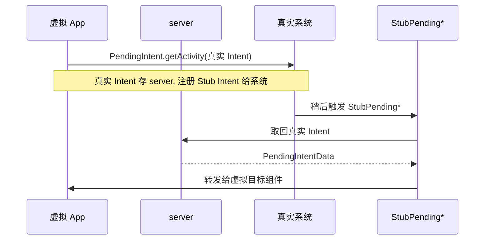

# StubPending · PendingIntent 存根族

::: tip 源码路径
`StubPendingActivity.java` · `StubPendingService.java` · `StubPendingReceiver.java`（[目录](https://github.com/android-security-engineer/VirtualXposed-skills/tree/vxp/VirtualApp/lib/src/main/java/com/lody/virtual/client/stub)）
:::

`StubPendingActivity` / `StubPendingService` / `StubPendingReceiver` 三个存根，让虚拟 App 注册的 PendingIntent 在真实系统触发后，能安全路由回虚拟环境。PendingIntent 跨进程、跨时间，身份一致性最难维护，这三个存根是关键。

## 为什么 PendingIntent 特殊

PendingIntent 是「预先创建、稍后由别人触发」的 Intent 句柄。虚拟 App 调 `PendingIntent.getActivity` 时，真实系统会按调用方身份校验。如果直接用虚拟 App 的真实 Intent 注册，触发时身份对不上。解法：

1. 注册时把真实 Intent 信息存到 server（[`PendingIntentData`](../remote/pendingintent-data)）。
2. 注册给真实系统的是指向 `StubPendingActivity` 的 Stub Intent。
3. 触发时真实系统启动 `StubPending*`。
4. 存根 `onCreate`/`onStartCommand`/`onReceive` 从 server 取回真实 Intent，转发给虚拟 App 的目标组件。

## 三件套

| 类 | 触发形态 | 还原方法 |
| --- | --- | --- |
| `StubPendingActivity extends Activity` | Activity 启动 | `onCreate` 取真实 Intent 还原 |
| `StubPendingService extends Service` | Service 启动 | `onStartCommand` 还原 |
| `StubPendingReceiver extends BroadcastReceiver` | 广播投递 | `onReceive` 还原 |

## 与真实组件的关系

存根本身不做事，只把「真实系统认可的宿主身份」借给虚拟 PendingIntent 用，触发后立刻把控制权交还虚拟 App。
## PendingIntent 注册与触发还原

## 关联

- [`PendingIntentData` / `PendingResultData`](../remote/pendingintent-data)：跨进程数据载体。
- [`PendingIntents`](../server/am-classes/pending-intents)：server 端管理器。
- [Stub Activity 机制](../../features/stub-activity)。
