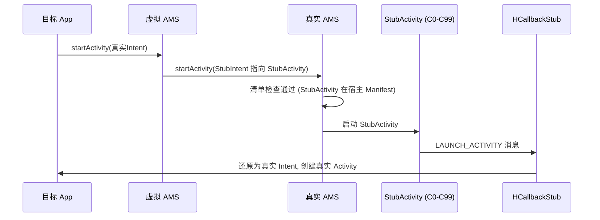

# client/stub · Stub 组件

::: tip 源码路径
[`src/main/java/com/lody/virtual/client/stub/`](https://github.com/android-security-engineer/VirtualXposed-skills/tree/vxp/VirtualApp/lib/src/main/java/com/lody/virtual/client/stub)
:::

声明在宿主 Manifest 里的占位组件，共 **17 个文件**。这些组件在真实系统层面"伪装"成宿主自己的组件，欺骗 AMS 清单检查，运行时再还原真实意图。详见 [Stub Activity 机制](../../features/stub-activity)。

## 文件组成

### Stub Activity（100 个存根 C0-C99 的宿主类）

| 文件 | 职责 |
| --- | --- |
| `StubActivity.java` | 主存根 Activity，欺骗 AMS 清单检查 |
| `StubDialog.java` | Dialog 风格存根 |
| `StubExcludeFromRecentActivity.java` | 不进最近任务列表的存根 |
| `StubPendingActivity.java` | PendingIntent 用的存根 |
| `ResolverActivity.java` / `ChooserActivity.java` / `ChooseTypeAndAccountActivity.java` / `ChooseAccountTypeActivity.java` | 系统 Resolver/Chooser 的虚拟实现 |
| `ShortcutHandleActivity.java` | 快捷方式入口 |

### Stub Service / Receiver

| 文件 | 职责 |
| --- | --- |
| `StubJob.java` / `DaemonJobService.java` | 作业/守护 Service |
| `StubPendingService.java` | PendingIntent 用的 Service |
| `StubPendingReceiver.java` | PendingIntent 用的 Receiver |
| `DaemonService.java` | 守护进程 Service（保活 server） |
| `AmsTask.java` | AMS 异步任务 |

### Provider / 配置

| 文件 | 职责 |
| --- | --- |
| `StubCP.java` | 客户端侧占位 ContentProvider（server 反向调用入口） |
| `VASettings.java` | 宿主配置常量（包名前缀、authority 等） |

## Stub Activity 工作流

## 子文档详解

每个组件族都有独立文档：

| 文档 | 主题 |
| --- | --- |
| [`StubActivity` 族](./stub-activity-family) | 100 个存根欺骗 AMS 清单检查 |
| [`StubDialog`](./stub-dialog) | Dialog 主题存根变体 |
| [`StubExcludeFromRecentActivity`](./stub-exclude-recent) | 不进最近任务的存根 |
| [`StubPending` 族](./stub-pending) | PendingIntent 用的 Activity/Service/Receiver 存根 |
| [`Chooser` / `Resolver`](./stub-chooser) | 系统选择器的虚拟实现 |
| [`StubCP`](./stub-cp) | 占位 ContentProvider，server 反向调用入口 |
| [`Daemon` 保活](./stub-daemon) | `DaemonService` + `DaemonJobService` 保活 server |
| [`VASettings`](./va-settings) | 宿主配置常量（类名/authority/开关） |
