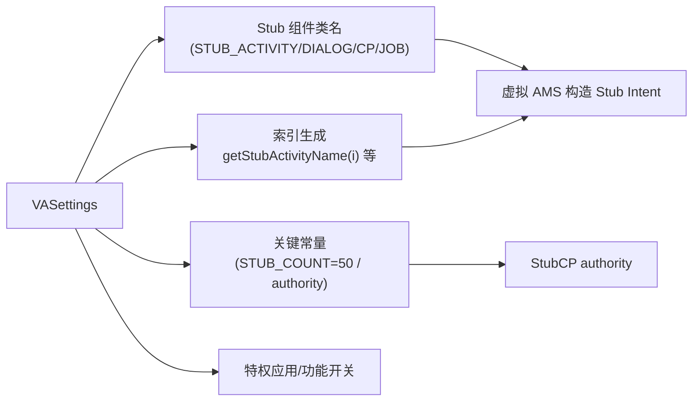

# VASettings · 宿主配置

::: tip 源码路径
[`src/main/java/com/lody/virtual/client/stub/VASettings.java`](https://github.com/android-security-engineer/VirtualXposed-skills/blob/vxp/VirtualApp/lib/src/main/java/com/lody/virtual/client/stub/VASettings.java)
:::

`VASettings` 集中存放宿主运行所需的配置常量：Stub 组件类名、authority、存根数量、特权应用清单、功能开关。整个虚拟化引擎的「宿主身份参数」都在这里。

## Stub 组件类名映射

```java
public static String STUB_ACTIVITY = StubActivity.class.getName();
public static String STUB_DIALOG = StubDialog.class.getName();
public static String STUB_CP = StubCP.class.getName();
public static String STUB_JOB = StubJob.class.getName();
public static String RESOLVER_ACTIVITY = ResolverActivity.class.getName();
public static String STUB_EXCLUDE_FROM_RECENT_ACTIVITY = ...;
```

虚拟 AMS 构造 Stub Intent 时引用这些类名。

## 索引生成

| 方法 | 作用 |
| --- | --- |
| `getStubActivityName(int index)` | 第 N 个 StubActivity 子类名 |
| `getStubDialogName(int index)` | 第 N 个 StubDialog 子类名 |
| `getStubCP(int index)` / `getStubAuthority(int index)` | 第 N 个 StubCP 类名 / authority |

## 关键常量

| 常量 | 默认值 | 含义 |
| --- | --- | --- |
| `STUB_DEF_AUTHORITY` / `STUB_CP_AUTHORITY` | `virtual_stub_` | StubCP authority 前缀 |
| `STUB_COUNT` | `50` | 存根数量 |
| `ACTION_BADGER_CHANGE` | `com.lody.virtual.BADGER_CHANGE` | 角标变更广播 action |
| `PRIVILEGE_APPS` | `String[]{}` | 特权应用清单（不受隔离约束） |
| `ENABLE_INNER_SHORTCUT` | `true` | 是否启用内部快捷方式 |
| `ENABLE_IO_REDIRECT` | `true` | 是否启用 IO 重定向 |

## 内部配置类

`VASettings` 还内嵌 `Wifi` 等子配置类，存放细分领域常量。
## 配置全景




## 关联

- [`StubActivity` 族](./stub-activity-family)：用它的类名和索引。
- [`StubCP`](./stub-cp)：authority 来源。
- [Stub Activity 机制](../../features/stub-activity)。
