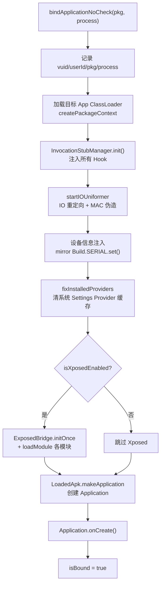
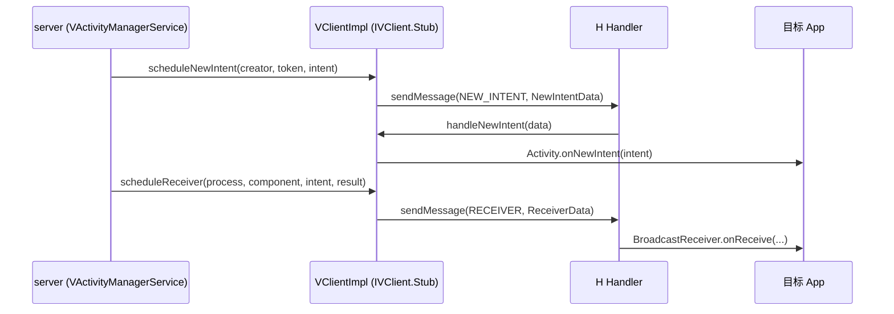

# client/VClientImpl · 客户端核心

::: tip 源码路径
[`src/main/java/com/lody/virtual/client/VClientImpl.java`](https://github.com/android-security-engineer/VirtualXposed-skills/blob/vxp/VirtualApp/lib/src/main/java/com/lody/virtual/client/VClientImpl.java)
:::

`VClientImpl` 是虚拟 App 进程的客户端核心，`extends IVClient.Stub`（单例 `gClient`）。它是 server 反向驱动客户端的入口，也负责 `bindApplication`——把宿主进程"变成"目标 App 的全部工作都在这里发生。

## 职责

- **`bindApplicationNoCheck`**：绑定 Application 的核心——加载目标 App 代码、注册所有 Hook、Xposed 初始化、IO 重定向、设备信息注入、`makeApplication`
- **`IVClient` 接口实现**：暴露 `appThread`/`token` 等给 server，server 通过它反向驱动生命周期（`scheduleNewIntent`/`scheduleReceiver`）
- **进程身份**：记录当前 vuid/userId/packageName/processName
- **`H` Handler**：处理 server 发来的 `NEW_INTENT`/`RECEIVER` 消息

## 单例与状态

```java
public final class VClientImpl extends IVClient.Stub {
    private static final VClientImpl gClient = new VClientImpl();
    public static VClientImpl get() { return gClient; }

    public boolean isBound();
    public int getVUid();
    public int getBaseVUid();
    public VDeviceInfo getDeviceInfo();
    public Application getCurrentApplication();
    public String getCurrentPackage();
    public ApplicationInfo getCurrentApplicationInfo();
    public ClassLoader getClassLoader(ApplicationInfo appInfo);
    public CrashHandler getCrashHandler();
}
```

进程身份字段（`vuid`/`userId`/`packageName`/`processName`）在 `initProcess` 时由 server 写入，`bindApplication` 据此加载对应包。

## IVClient 接口：server 反向驱动客户端

`VClientImpl` 实现 `IVClient.Stub`，暴露以下方法给 server 进程跨进程调用：

| 方法 | 触发场景 | 作用 |
| --- | --- | --- |
| `getAppThread()` | server 首次绑定进程 | 返回客户端 `IApplicationThread`，server 据此调度生命周期 |
| `getToken()` | server 需要进程 token | 返回进程身份 token |
| `initProcess(IBinder token, int vuid)` | 进程刚被拉起 | 写入进程身份（token + vuid），为 bindApplication 做准备 |
| `bindApplication(pkg, process)` | server 决定绑定 App | 入口，转 `bindApplicationNoCheck` |
| `bindApplicationForActivity(pkg, process, intent)` | 首个 Activity 启动 | Activity 专用绑定路径 |
| `scheduleNewIntent(creator, token, intent)` | 新 Intent 到达已有 Activity | 投递 `NEW_INTENT` 消息到 `H` |
| `scheduleReceiver(process, component, intent, result)` | 广播分发到该进程 | 投递 `RECEIVER` 消息到 `H` |
| `acquireProviderClient(ProviderInfo)` | App 查虚拟 Provider | 返回虚拟 ContentProvider 的 binder |
| `createProxyService(component, binder)` | bindService | 包装服务 binder |
| `finishActivity(token)` | server 结束某 Activity | 客户端侧收尾 |
| `getDebugInfo()` | 诊断 | 返回进程调试信息 |

## bindApplication 流程

`bindApplicationNoCheck` 是核心，把一个普通宿主进程变成目标 App：



各步骤落在子模块：

| 步骤 | 实现 | 关联文档 |
| --- | --- | --- |
| 注入 Hook | `InvocationStubManager.injectAll()` | [`InvocationStubManager`](./core) · [Hook 基类](./hook-base) |
| IO 重定向 | `startIOUniformer()` → `NativeEngine` | [`NativeEngine`](./native-engine) · [虚拟存储](../server/vs) |
| 设备信息 | `mirror.android.os.Build.SERIAL.set(...)` | [设备信息伪造](../../features/device-spoofing) |
| Provider 修复 | `fixInstalledProviders` / `clearSettingProvider` | [Provider Hook](./hook-providers) |
| Xposed | `ExposedBridge.initOnce` + `loadModule` | [免 Root Hook 原理](../../xposed/how-it-works) |

## H Handler：生命周期消息分发

server 调 `scheduleNewIntent`/`scheduleReceiver` 后，客户端 `H` Handler 在主线程处理：



`NEW_INTENT = 11`、`RECEIVER = 12` 是 `H` 的消息常量。这套机制让 server 能像真实 AMS 一样反向驱动客户端进程的生命周期——虚拟环境内 App 的行为与真机一致。

## 其他职责

- **`fixWeChatRecovery`**：针对微信恢复机制的特殊兼容修复（宿主常见适配点）
- **`setupUncaughtHandler`**：注册 `Thread.setDefaultUncaughtExceptionHandler`，捕获虚拟 App 崩溃并按虚拟身份上报，避免污染宿主
- **`getClassLoader`**：按 `ApplicationInfo`/包名加载目标 App 的 ClassLoader，缓存复用

## 关联

- [`InvocationStubManager`](./core)：`bindApplication` 时注入所有 Hook。
- [`NativeEngine`](./native-engine)：IO 重定向与 native 桥。
- [应用虚拟化](../../features/app-virtualization)：`bindApplication` 在整体流程中的位置。
- [免 Root Hook 原理](../../xposed/how-it-works)：Xposed 模块加载。
- [活动管理 (AMS)](../../features/activity-manager)：server 侧反向驱动客户端的对应实现。
