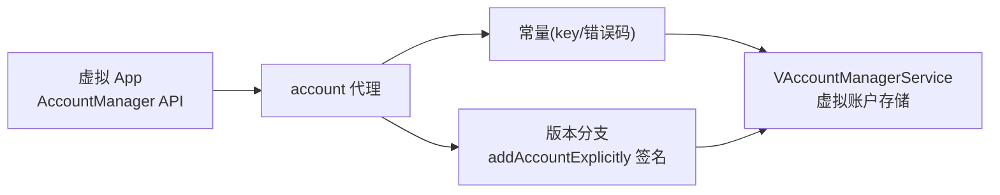

# AccountManagerCompat · 账户兼容

::: tip 源码路径
[`src/main/java/com/lody/virtual/helper/compat/AccountManagerCompat.java`](https://github.com/android-security-engineer/VirtualXposed-skills/blob/vxp/VirtualApp/lib/src/main/java/com/lody/virtual/helper/compat/AccountManagerCompat.java)
:::

`AccountManagerCompat` 抹平 `AccountManager` 跨版本差异，集中存放账户相关的常量（key 名、错误码），供 [account 代理](../../proxies/account) 与 [`VAccountManagerService`](../../server/accounts) 引用。

## 常量

| 常量 | 值 | 用途 |
| --- | --- | --- |
| `KEY_CUSTOM_TOKEN_EXPIRY` | `android.accounts.expiry` | 账户 token 自定义过期时间 |
| `KEY_LAST_AUTHENTICATED_TIME` | `lastAuthenticatedTime` | 上次认证时间 |
| `KEY_NOTIFY_ON_FAILURE` | `notifyOnAuthFailure` | 认证失败是否通知 |
| `KEY_ANDROID_PACKAGE_NAME` | `androidPackageName` | 调用方包名 |
| `ERROR_CODE_USER_RESTRICTED` | `100` | 用户受限错误码 |
| `ERROR_CODE_MANAGEMENT_DISABLED_FOR_ACCOUNT_TYPE` | `101` | 该账户类型管理被禁用 |

## 为什么需要它

账户 `addAccountExplicitly` / `setUserData` 等接口在不同版本签名、返回值、可用的 key 集合不同。把这些常量与版本分支逻辑收敛到一处，避免散落在各 `MethodProxy` 里硬编码字符串导致拼写错。

## 在账户流程中的位置

常量 `KEY_*` 是 AccountManager Bundle 里的约定 key 名，`ERROR_CODE_*` 是认证错误码——集中存放避免各代理拼写错。

## 关联

- [account 代理](../../proxies/account)：拦截 `AccountManager` 调用。
- [`VAccountManagerService`](../../server/accounts)：虚拟账户存储。
