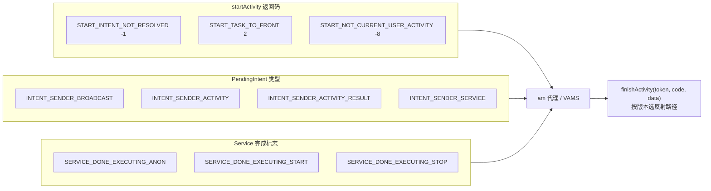

# ActivityManagerCompat · AMS 兼容

::: tip 源码路径
[`src/main/java/com/lody/virtual/helper/compat/ActivityManagerCompat.java`](https://github.com/android-security-engineer/VirtualXposed-skills/blob/vxp/VirtualApp/lib/src/main/java/com/lody/virtual/helper/compat/ActivityManagerCompat.java)
:::

`ActivityManagerCompat` 抹平 `ActivityManager` / `IActivityManager` 跨版本差异，集中存放 AMS 相关常量（启动结果码、IntentSender 类型、Service 执行完成标志）并提供 `finishActivity` 等版本适配方法。

## 常量

| 常量 | 含义 |
| --- | --- |
| `START_INTENT_NOT_RESOLVED` (`-1`) | 启动 Intent 找不到目标组件 |
| `START_TASK_TO_FRONT` (`2`) | 仅把任务切到前台 |
| `START_NOT_CURRENT_USER_ACTIVITY` (`-8`) | 目标 Activity 不属于当前用户 |
| `INTENT_SENDER_BROADCAST`/`_ACTIVITY`/`_ACTIVITY_RESULT`/`_SERVICE` | PendingIntent 的四种类型 |
| `SERVICE_DONE_EXECUTING_ANON`/`_START`/`_STOP` | Service 执行完成的回调标志 |
| `USER_OP_SUCCESS` | 用户操作成功 |

## 方法

| 方法 | 作用 |
| --- | --- |
| `finishActivity(IBinder token, int code, Intent data)` | 结束指定 Activity（按版本选 `ActivityManagerNative` 或 `ActivityManagerService` 反射路径） |

## 用途

[AMS 代理](../../proxies/am) 与 [`VActivityManagerService`](../../server/am) 处理 `startActivity` 返回值、调度 Service 生命周期时引用这些常量，避免魔数。

## 常量在调度中的位置

## 关联

- [am 代理](../../proxies/am)、[`VActivityManagerService`](../../server/am)。
- [活动管理](/features/activity-manager) 机制总览。
