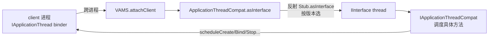

# ApplicationThreadCompat · 应用线程兼容

::: tip 源码路径
[`src/main/java/com/lody/virtual/helper/compat/ApplicationThreadCompat.java`](https://github.com/android-security-engineer/VirtualXposed-skills/blob/vxp/VirtualApp/lib/src/main/java/com/lody/virtual/helper/compat/ApplicationThreadCompat.java)
:::

`ApplicationThreadCompat` 把 client 传上来的 `IApplicationThread` Binder 转成 `IInterface`，供 server 反向驱动 client 生命周期。

## 方法

| 方法 | 作用 |
| --- | --- |
| `asInterface(IBinder binder)` | 把 binder 句柄转成 `IApplicationThread` 的 `IInterface` |

## 为什么需要单独一个类

`IApplicationThread.Stub.asInterface` 是隐藏 API，且不同版本的 `IApplicationThread` 是不同的内部类/接口。`asInterface` 在这里用反射按版本找到正确的 `Stub.asInterface` 静态方法调用。

## 用途

`VActivityManagerService.attachClient` 用 `asInterface` 拿到 `IInterface thread`，再交给 [`IApplicationThreadCompat`](./iapplication-thread-compat) 调度具体生命周期方法。

## binder 转接口流

## 关联

- [`IApplicationThreadCompat`](./iapplication-thread-compat)：拿到接口后调方法。
- [`VActivityManagerService`](../../server/am)：`attachClient` 调用方。
- [活动管理](/features/activity-manager)。
