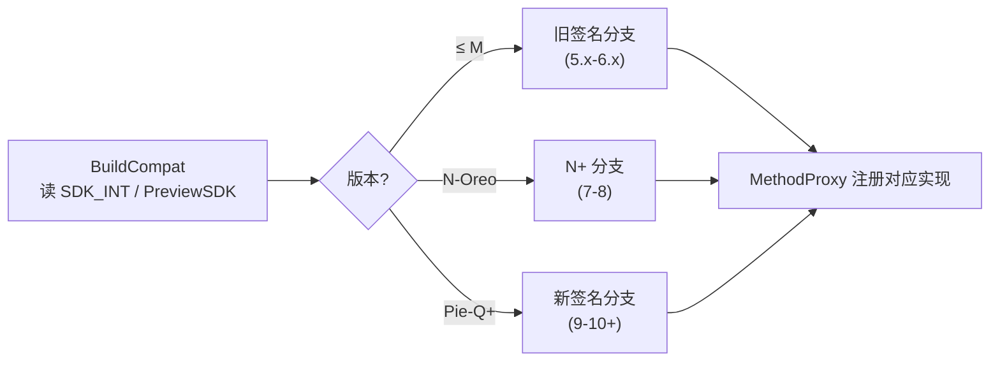
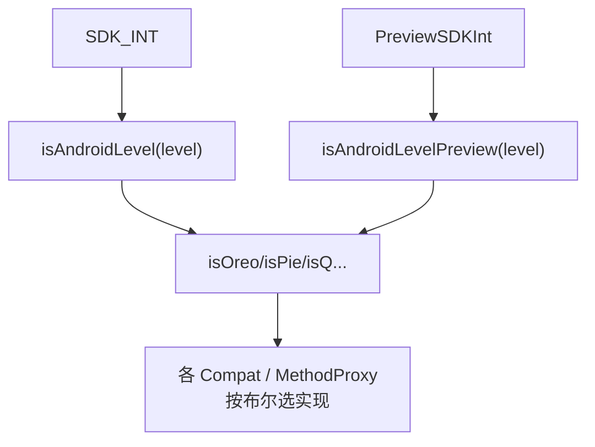

# BuildCompat · 版本判定

::: tip 源码路径
[`src/main/java/com/lody/virtual/helper/compat/BuildCompat.java`](https://github.com/android-security-engineer/VirtualXposed-skills/blob/vxp/VirtualApp/lib/src/main/java/com/lody/virtual/helper/compat/BuildCompat.java)
:::

`BuildCompat` 封装 SDK 版本判定，是整个 compat 层的判定基础——各 Hook 按它返回的布尔值选不同实现，抹平版本差异。

## 方法

| 方法 | 判定 |
| --- | --- |
| `isOreo()` | Android 8.0 (API 26) |
| `isPie()` | Android 9 (API 28) |
| `isQ()` | Android 10 (API 29) |
| `isR()` | Android 11 (API 30) |
| `isS()` | Android 12 (API 31) |
| `getPreviewSDKInt()` | 预览版 SDK 整数 |

## 实现要点

- `isAndroidLevel(int level)` 比较 `Build.VERSION.SDK_INT`。
- `isAndroidLevelPreview(int level)` 处理预览版（`SDK_INT` 还没升到正式值，靠 `getPreviewSDKInt` 判定）。
- 每个布尔方法就是 `isAndroidLevel(对应常量)` 的别名。

## 用途

VirtualXposed 支持范围是 Android 5.0 ~ 10.0，但代码里也写了 11/12 的适配分支（见 git 历史大量 "Android 11/12: Fix …" 提交）。各 `MethodProxy` 注册时按 `BuildCompat.isOreo()` 等选择是否注册、用哪套签名。

## 版本判定在 Hook 中的作用

## 关联

- [`OSUtils`](../utils/os-utils)：管厂商 ROM，与版本判定互补。
- [compat 总览](../helper-compat)。
