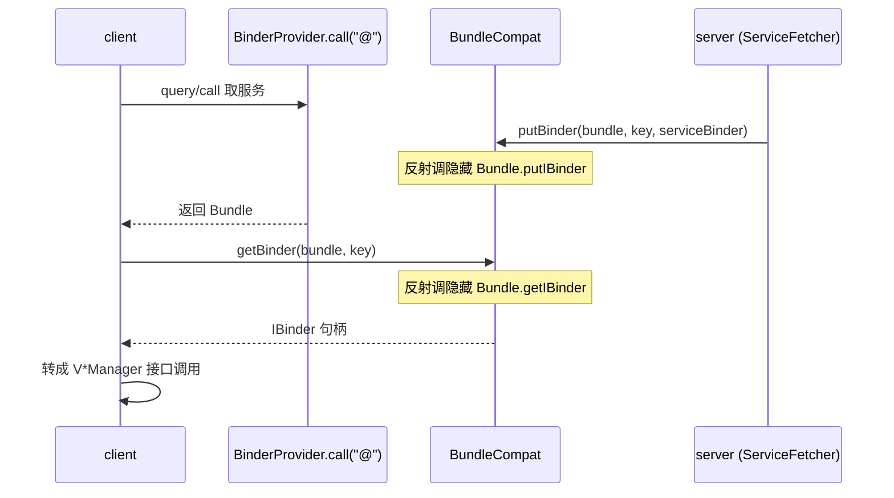

# BundleCompat · Bundle 兼容

::: tip 源码路径
[`src/main/java/com/lody/virtual/helper/compat/BundleCompat.java`](https://github.com/android-security-engineer/VirtualXposed-skills/blob/vxp/VirtualApp/lib/src/main/java/com/lody/virtual/helper/compat/BundleCompat.java)
:::

`BundleCompat` 解决一个核心需求：**把 `IBinder` 句柄塞进 `Bundle` 跨进程传递，再从另一端取出来**。这是 [IPC 桥](../../../features/ipc-bridge) 跨进程传 binder 的关键。

## 方法

| 方法 | 作用 |
| --- | --- |
| `getBinder(Bundle bundle, String key)` | 从 Bundle 取出先前放入的 `IBinder` |
| `putBinder(Bundle bundle, String key, IBinder value)` | 把 `IBinder` 放进 Bundle |
| `clearParcelledData(Bundle bundle)` | 清理 Bundle 内部的 Parcel 数据（释放内存） |

## 为什么需要它

`Bundle` 不直接支持 `IBinder` 类型（`putBinder` 是隐藏 API `Bundle.putIBinder`/`getIBinder`）。但跨进程传 binder 是 VirtualXposed 的命脉——client 通过 `ContentProvider.call` 向 server 取服务 binder 时，binder 句柄就是放在返回 `Bundle` 里传回来的。本类用反射调隐藏方法实现。

## 用途

[IPC 桥](../../../features/ipc-bridge) 的 `BinderProvider.call("@")` 用 `BundleCompat.putBinder` 把 `ServiceFetcher` IBinder 放进返回的 Bundle，客户端用 `getBinder` 取出。后续所有 `V*Manager` 跨进程调用都建立在这条通道上。

## binder 跨进程传递流

## 关联

- [IPC 桥](../../../features/ipc-bridge)：核心使用场景。
- [`ContentProviderCompat`](./content-provider-compat)：`call` 的载体。
- [client/ipc](../../client/ipc)。
