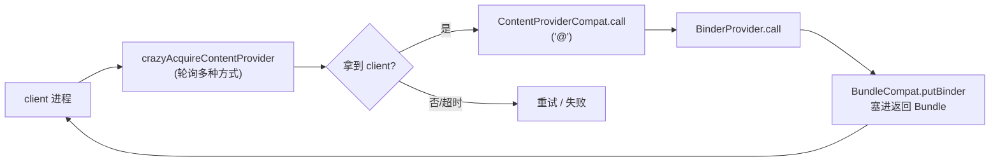

# ContentProviderCompat · ContentProvider 兼容

::: tip 源码路径
[`src/main/java/com/lody/virtual/helper/compat/ContentProviderCompat.java`](https://github.com/android-security-engineer/VirtualXposed-skills/blob/vxp/VirtualApp/lib/src/main/java/com/lody/virtual/helper/compat/ContentProviderCompat.java)
:::

`ContentProviderCompat` 抹平 `ContentProvider` 跨版本访问差异，提供 `call` 调用与「疯狂获取 Provider」的容错路径。它是 [IPC 桥](../../../features/ipc-bridge) 跨进程通信的关键基石。

## 方法

| 方法 | 作用 |
| --- | --- |
| `call(Context, Uri, method, arg, extras)` | 通过 `ContentResolver.call` 调用 Provider 的自定义方法 |
| `crazyAcquireContentProvider(Context, Uri)` | 多种方式尝试拿到 `ContentProviderClient`（按 uri） |
| `crazyAcquireContentProvider(Context, String)` | 同上，按 Provider 名 |
| `releaseQuietly(ContentProviderClient)` | 空安全释放 client |

## crazyAcquire 的设计

VirtualXposed 的 `BinderProvider` 是个 ContentProvider，client 要先 `acquireContentProvider` 拿到它的 `ContentProviderClient` 才能跨进程 `call("@")` 取 binder。但不同 Android 版本、不同厂商对 `acquireContentProviderClient` 的可用性和返回时机有差异。`crazyAcquire` 名字里的 "crazy" 正是指它**轮询多种方式**（直接 acquire、间接通过 resolver、重试）直到拿到或超时，保证在严苛环境下也能建立 IPC 通道。

## IPC 通道建立流

## 关联

- [IPC 桥](../../../features/ipc-bridge)：`BinderProvider.call` 依赖此工具。
- [client/ipc](../../client/ipc)：`ServiceManagerNative` 建立 binder 连接。
- [`BundleCompat`](./bundle-compat)：call 的 extras 里塞/取 binder。
