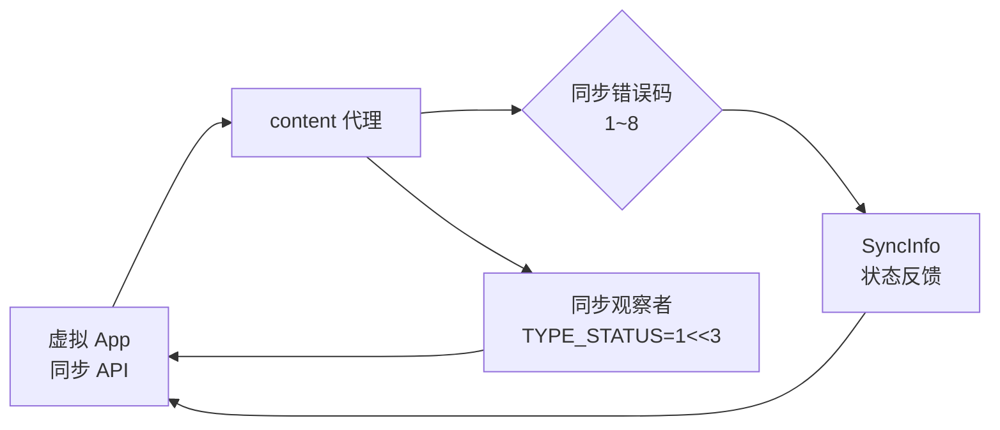

# ContentResolverCompat · ContentResolver 兼容

::: tip 源码路径
[`src/main/java/com/lody/virtual/helper/compat/ContentResolverCompat.java`](https://github.com/android-security-engineer/VirtualXposed-skills/blob/vxp/VirtualApp/lib/src/main/java/com/lody/virtual/helper/compat/ContentResolverCompat.java)
:::

`ContentResolverCompat` 抹平 `ContentResolver` 同步相关常量的跨版本差异，集中存放同步观察者类型与同步错误码。

## 常量

| 类别 | 常量 |
| --- | --- |
| 同步观察者类型 | `SYNC_OBSERVER_TYPE_STATUS` (`1<<3`) |
| 同步错误码 | `SYNC_ERROR_SYNC_ALREADY_IN_PROGRESS` (`1`)、`SYNC_ERROR_AUTHENTICATION` (`2`)、`SYNC_ERROR_IO` (`3`)、`SYNC_ERROR_PARSE` (`4`)、`SYNC_ERROR_CONFLICT` (`5`)、`SYNC_ERROR_TOO_MANY_DELETIONS` (`6`)、`SYNC_ERROR_TOO_MANY_RETRIES` (`7`)、`SYNC_ERROR_INTERNAL` (`8`) |

## 为什么需要它

`ContentResolver` 的同步（sync）相关 API 在不同 SDK 版本里常量值、方法签名有微调。把这些 magic number 收敛到一处，[content 代理](../../proxies/content) 处理同步状态查询、[SyncInfo](../../remote/sync-info) 序列化时引用，避免硬编码。

## 在同步流程中的位置

## 关联

- [content 代理](../../proxies/content)。
- [`SyncInfo`](../../remote/sync-info)：同步信息载体。
