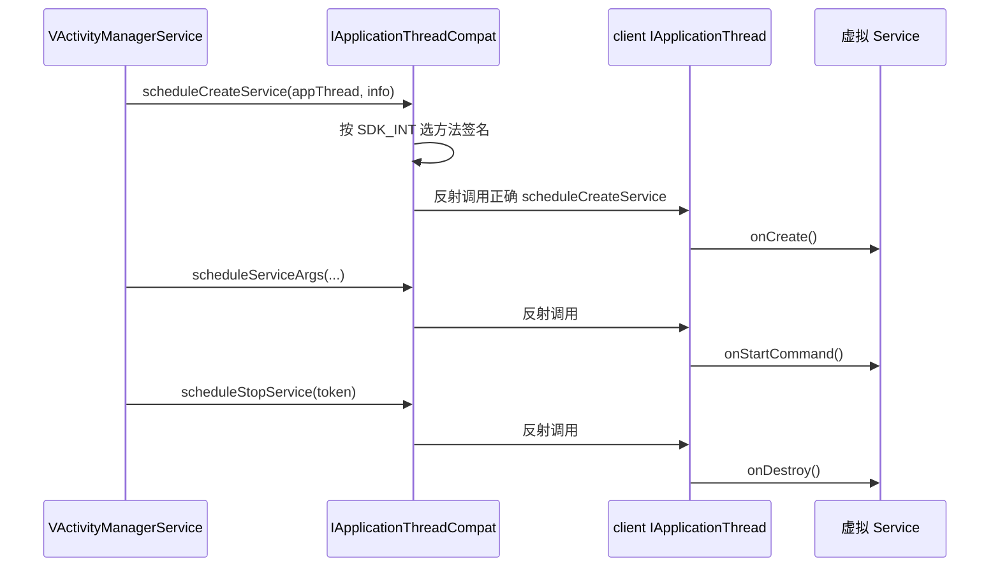

# IApplicationThreadCompat · 应用线程接口兼容

::: tip 源码路径
[`src/main/java/com/lody/virtual/helper/compat/IApplicationThreadCompat.java`](https://github.com/android-security-engineer/VirtualXposed-skills/blob/vxp/VirtualApp/lib/src/main/java/com/lody/virtual/helper/compat/IApplicationThreadCompat.java)
:::

`IApplicationThreadCompat` 抹平 `IApplicationThread` 这个隐藏接口的跨版本差异。`IApplicationThread` 是 server 反向驱动 client App 生命周期的 binder 接口（调度创建 Service、绑定、解绑、传参、停止），各版本方法签名不同，本类用反射按版本选正确签名调用。

## 方法

| 方法 | 作用 |
| --- | --- |
| `scheduleCreateService(appThread, token, info, …)` | 调度 `onCreate` |
| `scheduleBindService(appThread, token, intent, rebind, …)` | 调度 `onBind`/`onRebind` |
| `scheduleUnbindService(appThread, token, intent)` | 调度 `onUnbind` |
| `scheduleServiceArgs(appThread, token, taskRemoved, …)` | 调度 `onStartCommand` |
| `scheduleStopService(appThread, token)` | 调度 `onDestroy` |

第一个参数 `appThread` 是 `IInterface`（client 传上来的 `IApplicationThread` 句柄），其余是具体调度参数。

## 用途

`VActivityManagerService` 调度虚拟 Service 生命周期时，不能直接 `cast` 成某个版本的 `IApplicationThread` 调方法（签名可能对不上），而是把这些调用委托给本类，由它按 SDK 版本反射调用正确签名。

## Service 生命周期反向驱动

## 关联

- [`ApplicationThreadCompat`](./application-thread-compat)：负责把 binder 转成 `IInterface`。
- [`VActivityManagerService`](../../server/am)：Service 调度调用方。
- [活动管理](/features/activity-manager)。
