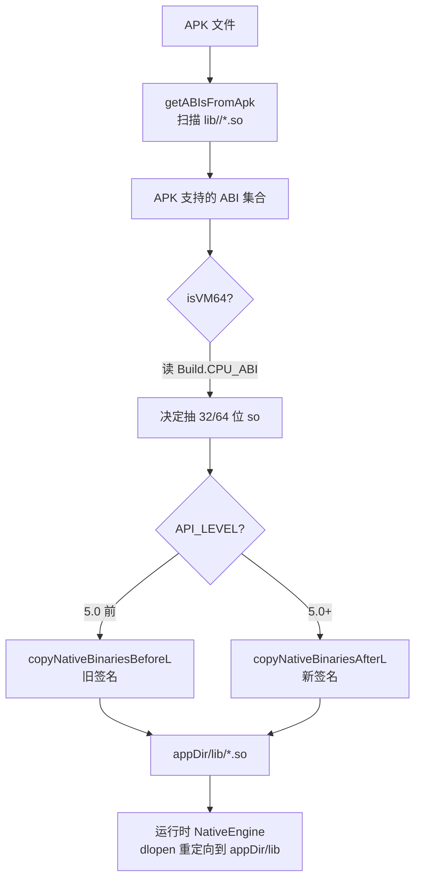

# NativeLibraryHelperCompat · native 库抽取兼容

::: tip 源码路径
[`src/main/java/com/lody/virtual/helper/compat/NativeLibraryHelperCompat.java`](https://github.com/android-security-engineer/VirtualXposed-skills/blob/vxp/VirtualApp/lib/src/main/java/com/lody/virtual/helper/compat/NativeLibraryHelperCompat.java)
:::

`NativeLibraryHelperCompat` 对应 AOSP 的 `NativeLibraryHelper`，在安装虚拟 App 时从 APK 抽取对应 ABI 的 `.so` 共享库到 lib 目录，供目标 App 运行时加载。

## 方法

| 方法 | 作用 |
| --- | --- |
| `copyNativeBinaries(File apkFile, File sharedLibraryDir)` | 从 APK 抽取 .so 到目标目录，返回抽取数量 |
| `isApk64(String apk)` | 判断 APK 是否含 64 位 so |
| `getABIsFromApk(String apk)` | 枚举 APK 内含的 ABI 集合（私有） |
| `isVM64(Set<String> supportedABIs)` | 判断当前虚拟机是否 64 位（私有） |

## 版本分支

- `copyNativeBinariesBeforeL` —— Android 5.0 之前用旧 `NativeLibraryHelper.copyNativeBinariesIfNeededLI`。
- `copyNativeBinariesAfterL` —— 5.0+ 用 `NativeLibraryHelper.copyNativeBinaries`（签名变了）。

## ABI 选择逻辑

1. `getABIsFromApk` 扫描 APK 内 `lib/<abi>/*.so`，得到 APK 支持的 ABI 集合。
2. `isVM64` 用 `Build.CPU_ABI` / `Build.SUPPORTED_ABIS` 判断当前进程是 32 位还是 64 位虚拟机。
3. 据此决定抽 32 位还是 64 位的 so，避免架构不匹配导致 `dlopen` 失败。

## 用途

`VAppManagerService.installPackage` 复制 APK 后调用 `copyNativeBinaries`，把 .so 抽到 `appDir/lib/`。运行时 [`NativeEngine`](../../client/native-engine) 配置 `dlopen` 重定向到这个目录。

## 安装时 so 抽取流

架构判断错误会导致 `dlopen` 失败，所以 `isVM64` 必须读真实 `Build` 字段（不被伪造干扰）。

## 关联

- [包管理](/features/package-manager) 安装流程。
- [`VAppManagerService`](../../server/pm)。
- [`NativeEngine`](../../client/native-engine)：运行时 so 加载重定向。
