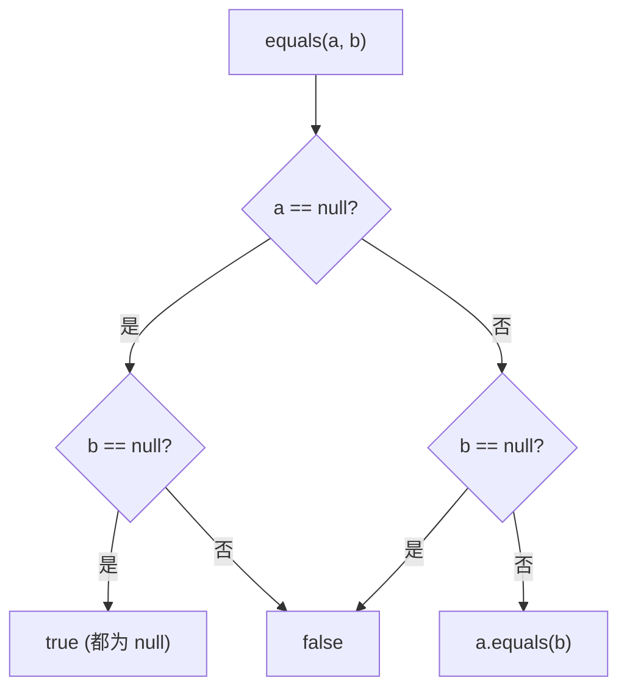

# ObjectsCompat · Objects 工具

::: tip 源码路径
[`src/main/java/com/lody/virtual/helper/compat/ObjectsCompat.java`](https://github.com/android-security-engineer/VirtualXposed-skills/blob/vxp/VirtualApp/lib/src/main/java/com/lody/virtual/helper/compat/ObjectsCompat.java)
:::

`ObjectsCompat` 是 `java.util.Objects` 的低版本兼容替代。`Objects` 类在 API 19+ 才有，VirtualXposed 要兼容更低版本时用它提供等价的 `equals`。

## 方法

| 方法 | 作用 |
| --- | --- |
| `equals(Object a, Object b)` | 空安全的相等判断：两个 `null` 相等，单个 `null` 不等，否则 `a.equals(b)` |

## 用途

全框架最常用的工具之一。`MethodProxy` 比较参数、[`ArrayUtils`](../utils/array-utils) 查找元素、[`ComponentUtils`](../utils/component-utils) 比较 Intent 字段，都依赖 `ObjectsCompat.equals` 做空安全比较，避免到处写 `a == null ? b == null : a.equals(b)`。

## 空安全判断

## 关联

- [`ArrayUtils`](../utils/array-utils) 内部使用。
- [`ComponentUtils`](../utils/component-utils) 内部使用。
