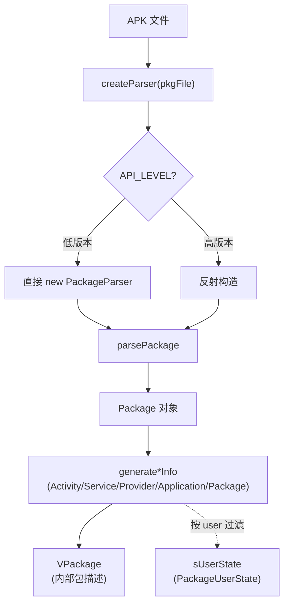

# PackageParserCompat · APK 解析兼容

::: tip 源码路径
[`src/main/java/com/lody/virtual/helper/compat/PackageParserCompat.java`](https://github.com/android-security-engineer/VirtualXposed-skills/blob/vxp/VirtualApp/lib/src/main/java/com/lody/virtual/helper/compat/PackageParserCompat.java)
:::

`PackageParserCompat` 抹平 `PackageParser` 这个隐藏类的跨版本差异。Android 各版本 `PackageParser` 的构造、`parsePackage` 签名、`generate*Info` 方法都不一样，本类按 SDK 选合适实现，是 PMS 解析 APK 的核心适配层。

## 方法

| 方法 | 作用 |
| --- | --- |
| `createParser(File packageFile)` | 按版本构造一个 `PackageParser` |
| `parsePackage(parser, packageFile, flags)` | 解析 APK 得到 `Package` 对象 |
| `generateServiceInfo(Service, flags)` | 生成 `ServiceInfo` |
| `generateApplicationInfo(Package, flags)` | 生成 `ApplicationInfo` |
| `generateActivityInfo(Activity, flags)` | 生成 `ActivityInfo` |
| `generateProviderInfo(Provider, flags)` | 生成 `ProviderInfo` |
| `generatePackageInfo(Package, flags, firstInstallTime, lastUpdateTime)` | 生成完整 `PackageInfo` |

## 内部状态

- `API_LEVEL` —— 构造时锁定 SDK 版本，决定走哪条分支。
- `myUserId` —— 当前用户 id（来自 `VUserHandle`），`generate*Info` 要按用户过滤可见组件。
- `sUserState` —— API 17+ 构造一个 `PackageUserState`（反射），`generate*Info` 据此过滤禁用组件。
- `GIDS` —— VirtualCore 提供的 gid 数组，填进 `PackageInfo`。

## 版本适配点

`createParser` 在不同版本构造 `PackageParser` 的方式不同（直接 new vs 反射）；`parsePackage` 在 N 以上签名变化；`generateActivityInfo` 在不同版本参数个数不同。本类把这些差异集中处理。

## APK 解析版本适配

## 用途

`VAppManagerService.installPackage` 解析 APK 的 `AndroidManifest` 时调用，把 APK 转成 `VPackage`（VirtualXposed 内部的包描述结构），后续组件调度、权限处理都基于它。

## 关联

- [包管理](/features/package-manager)。
- [`VAppManagerService`](../../server/pm)、[`VPackageManagerService`](../../server/pm)。
- [`BuildCompat`](./build-compat)：版本判定基础。
