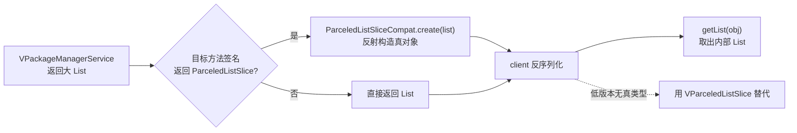
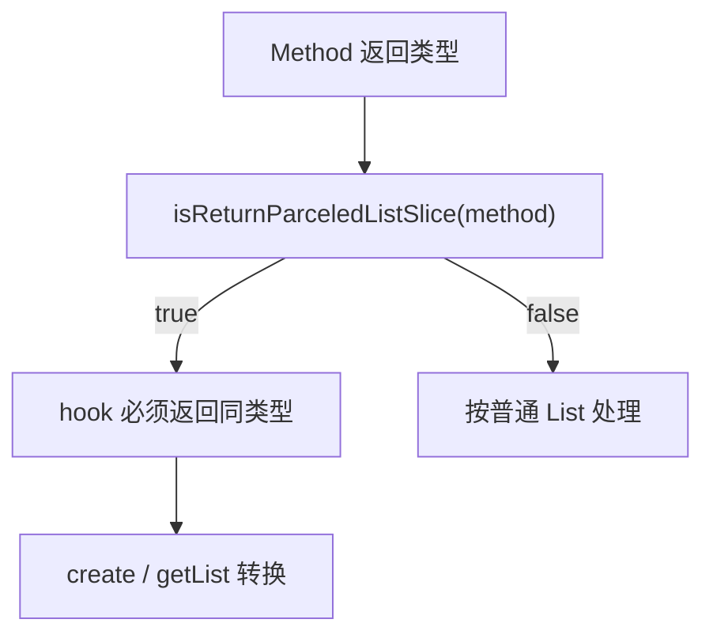

# ParceledListSliceCompat · List 跨进程兼容

::: tip 源码路径
[`src/main/java/com/lody/virtual/helper/compat/ParceledListSliceCompat.java`](https://github.com/android-security-engineer/VirtualXposed-skills/blob/vxp/VirtualApp/lib/src/main/java/com/lody/virtual/helper/compat/ParceledListSliceCompat.java)
:::

`ParceledListSliceCompat` 抹平 AOSP `ParceledListSlice` 的跨版本差异。Binder 单次传输有 1MB 上限，传大 `List<Parcelable>` 时 `ParceledListSlice` 会把列表拆成多个 Parcel 分批传。这个类在高版本暴露（`android.content.ParceledListSlice`），低版本不存在，本类统一包装。

## 方法

| 方法 | 作用 |
| --- | --- |
| `isReturnParceledListSlice(Method method)` | 判断某方法的返回类型是否为 `ParceledListSlice` |
| `create(List list)` | 用反射构造一个 `ParceledListSlice` 包装给定列表 |
| `getList(Object parceledList)` | 从一个 `ParceledListSlice` 取出内部 `List` |

## 用途

[PMS 代理](../../proxies/pm) / [`VPackageManagerService`](../../server/pm) 返回 `List<PackageInfo>` / `List<ResolveInfo>` 这类查询结果时，如果目标系统方法签名返回 `ParceledListSlice`，hook 必须返回同类型对象，否则 client 反序列化失败。本类负责在「真 `ParceledListSlice`」和「普通 `List`」之间转换。

VirtualXposed 自带一个 [`VParceledListSlice`](../../remote/vparceled-list-slice) 作为低版本的纯实现替代。

## List 跨进程兼容流

## 关联

- [`VParceledListSlice`](../../remote/vparceled-list-slice)：自带实现。
- [pm 代理](../../proxies/pm)、[`VPackageManagerService`](../../server/pm)。
