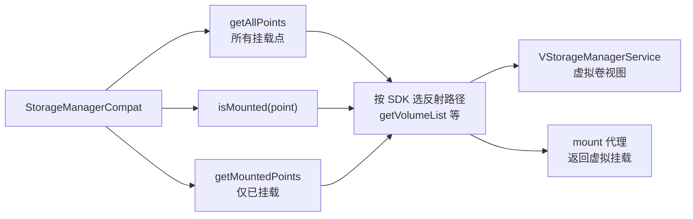

# StorageManagerCompat · 存储兼容

::: tip 源码路径
[`src/main/java/com/lody/virtual/helper/compat/StorageManagerCompat.java`](https://github.com/android-security-engineer/VirtualXposed-skills/blob/vxp/VirtualApp/lib/src/main/java/com/lody/virtual/helper/compat/StorageManagerCompat.java)
:::

`StorageManagerCompat` 抹平 `StorageManager` 跨版本差异，提供查询存储挂载点与挂载状态的方法，配合[虚拟存储](../../server/vs) 与 [mount 代理](../../proxies/mount)。

## 方法

| 方法 | 作用 |
| --- | --- |
| `getAllPoints(Context)` | 取所有存储挂载点路径数组 |
| `isMounted(Context, String point)` | 判断指定挂载点是否已挂载 |
| `getMountedPoints(Context)` | 取所有**已挂载**的挂载点列表 |

## 为什么需要它

`StorageManager.getVolumeList()` / `isExternalStorageEmulated()` 等方法签名随版本变化（API 14/21/24 各有调整），且部分是隐藏 API。本类按 SDK 选合适反射路径，统一返回挂载点信息。

## 用途

- [`VStorageManagerService`](../../server/vs) 据此构建虚拟存储卷视图。
- [mount 代理](../../proxies/mount) 拦截挂载状态查询时返回虚拟挂载信息。

## 存储查询流

## 关联

- [虚拟存储服务 `VStorageManagerService`](../../server/vs)。
- [mount 代理](../../proxies/mount)。
- [IO 重定向](/features/io-redirect)。
