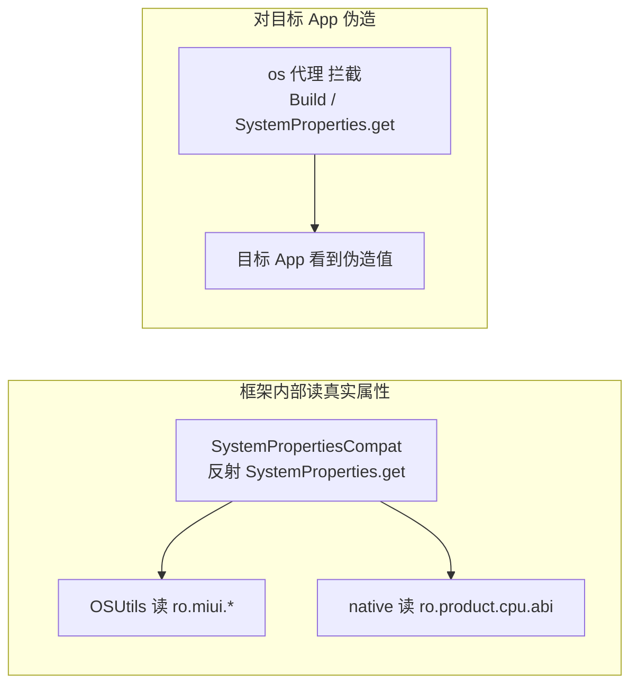

# SystemPropertiesCompat · 系统属性兼容

::: tip 源码路径
[`src/main/java/com/lody/virtual/helper/compat/SystemPropertiesCompat.java`](https://github.com/android-security-engineer/VirtualXposed-skills/blob/vxp/VirtualApp/lib/src/main/java/com/lody/virtual/helper/compat/SystemPropertiesCompat.java)
:::

`SystemPropertiesCompat` 用反射封装隐藏类 `android.os.SystemProperties`，提供读取 `ro.build.*` 等系统属性的能力。

## 方法

| 方法 | 作用 |
| --- | --- |
| `get(String key, String defaultValue)` | 取属性值，不存在返回默认值 |

## 实现细节

- 懒加载 `Class<?> sClass`（`Class.forName("android.os.SystemProperties")`）。
- `getInner` 反射调用 `SystemProperties.get(String, String)` 静态方法。
- 取不到类或方法失败时返回 `defaultValue`，不抛异常。

## 为什么需要它

`SystemProperties` 是 `@hide` 的，普通 App 不能直接 `import`。但框架多处需要读属性：[`OSUtils`](../utils/os-utils) 读 `ro.miui.ui.version.code` 判定 ROM、native 层读 `ro.product.cpu.abi` 选 hook 实现。本类把这些反射调用收敛到一处。

## 与设备伪造的关系

注意：本类读的是**真实**系统属性。设备信息**伪造**是在更上层——[os 代理](../../proxies/os) 拦截 `Build` / `SystemProperties.get` 调用并返回伪造值，而本类是框架内部读真实属性的底座。

## 真实属性 vs 伪造

两个层次互不干扰：框架判定 ROM/架构用真实属性，目标 App 看到的是伪造值。

## 关联

- [`OSUtils`](../utils/os-utils)：ROM 识别依赖它读 build.prop property。
- [os 代理](../../proxies/os)：设备标识伪造。
- [设备信息伪造](/features/device-spoofing)。
