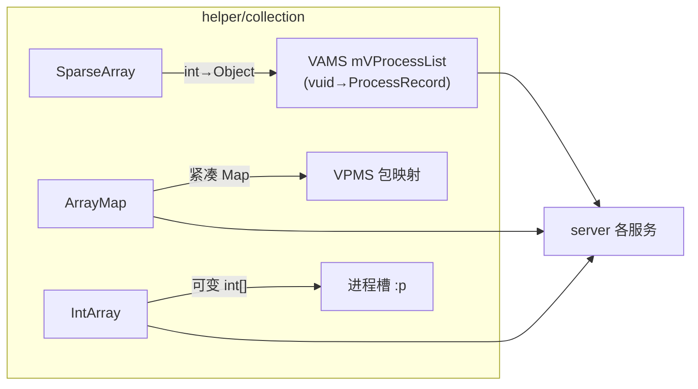

# helper/collection · 集合实现

::: tip 源码路径
[`src/main/java/com/lody/virtual/helper/collection/`](https://github.com/android-security-engineer/VirtualXposed-skills/tree/vxp/VirtualApp/lib/src/main/java/com/lody/virtual/helper/collection)
:::

自带的高性能集合实现，共 7 个文件。从 AOSP 移植，避免依赖高版本 API（部分集合在低版本 Android 不存在）。

## 类

| 类 | 对应 AOSP | 用途 |
| --- | --- | --- |
| `ArrayMap` | ArrayMap | 紧凑 Map |
| `SimpleArrayMap` | SimpleArrayMap | 不含 EntrySet 的 ArrayMap |
| `ArraySet` | ArraySet | 紧凑 Set |
| `SparseArray` | SparseArray | int→Object 映射（server 大量用） |
| `MapCollections` | MapCollections | Map/Set 共用底层 |
| `ContainerHelpers` | 容器辅助 | 二分查找等 |
| `IntArray` | IntArray | 可变 int 数组（[AMS](../server/am) 进程槽用） |

server 各服务（如 `VActivityManagerService` 的 `mVProcessList`）大量使用这些集合管理虚拟进程/包/用户映射。

## 集合在 server 中的使用

从 AOSP 移植避免依赖高版本 API——部分集合在低版本 Android 不存在。
