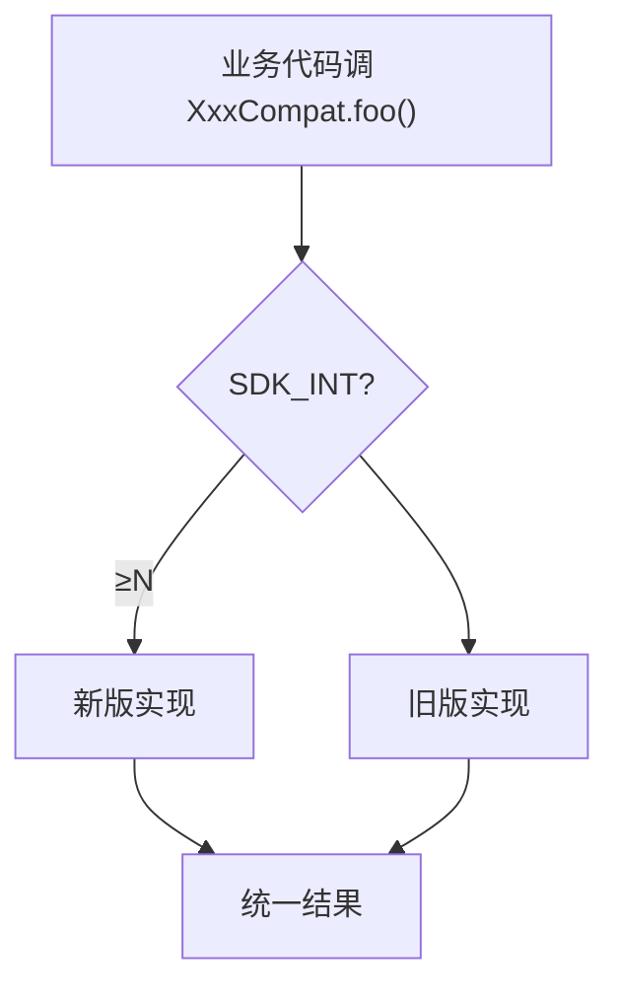

# helper/compat · 跨版本兼容

::: tip 源码路径
[`src/main/java/com/lody/virtual/helper/compat/`](https://github.com/android-security-engineer/VirtualXposed-skills/tree/vxp/VirtualApp/lib/src/main/java/com/lody/virtual/helper/compat)
:::

跨 Android 版本的兼容封装，共 14 个文件。VirtualXposed 支持 5.0~10.0，大量 API 在不同版本签名/位置不同，compat 层抹平差异。

## 关键类

| 类 | 兼容内容 |
| --- | --- |
| `BuildCompat` | SDK 版本判定（`isOreo`/`isN` 等），含厂商判定 |
| `BundleCompat` | `BundleCompat.putBinder`/`getBinder`（跨进程传 IBinder，[IPC 桥](../../features/ipc-bridge) 用） |
| `ActivityManagerCompat` | AMS API 跨版本 |
| `ApplicationThreadCompat` / `IApplicationThreadCompat` | 应用线程接口跨版本 |
| `PackageParserCompat` | `PackageParser` 跨版本（[PMS](../server/pm) 解析 APK） |
| `NativeLibraryHelperCompat` | native 库抽取跨版本（安装时抽 .so） |
| `ContentProviderCompat` / `ContentResolverCompat` | CP 跨版本访问 |
| `AccountManagerCompat` | 账户 API 跨版本 |
| `ParceledListSliceCompat` | `ParceledListSlice` 跨版本 |
| `StorageManagerCompat` | 存储管理跨版本 |
| `SystemPropertiesCompat` | `SystemProperties` 反射访问 |
| `ObjectsCompat` | `Objects` 工具（低版本无） |

## 设计模式

每个 compat 类内部按 `SDK_INT` 分支选不同实现：

业务代码只调 compat，不关心版本差异。
