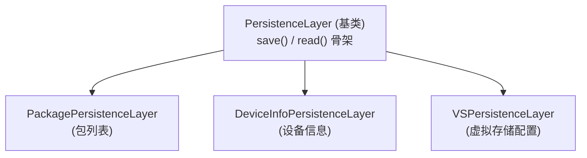

# helper 顶层 · 持久化与 dex 优化

::: tip 源码路径
[`src/main/java/com/lody/virtual/helper/`](https://github.com/android-security-engineer/VirtualXposed-skills/tree/vxp/VirtualApp/lib/src/main/java/com/lody/virtual/helper)（顶层三个文件）
:::

`helper/` 顶层有三个关键文件，为 server 各服务提供持久化和 dex 优化的基础设施。

## 文件组成

| 文件 | 职责 |
| --- | --- |
| `PersistenceLayer.java` | 持久化层**基类**，定义 `save`/`read` 骨架 |
| `ArtDexOptimizer.java` | ART dex 优化（dex2oat）封装 |
| `ParcelHelper.java` | Parcel 读写工具 |

## PersistenceLayer

server 多个服务需要把状态持久化到磁盘（包列表、设备信息、虚拟存储配置、定位配置），`PersistenceLayer` 是它们的统一基类：

子类只需实现序列化/反序列化细节（`writeResolve`/`readResolve`），基类负责文件 IO、异常处理、定时保存。这让 server 各服务的持久化逻辑高度一致。

## ArtDexOptimizer

安装虚拟 App 后，触发 dex2oat 把 dex 编译成 oat（提升运行性能）。封装跨版本 dex 优化调用，处理各版本 `dexopt`/`dex2oat` 接口差异。
