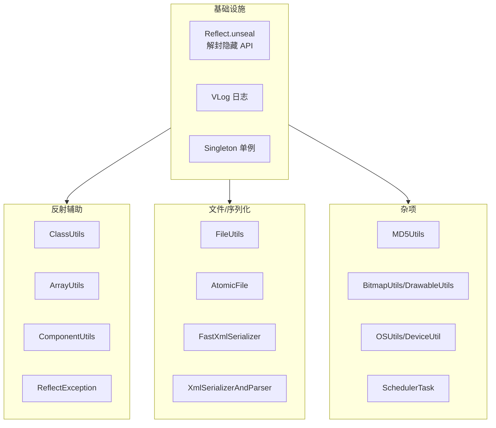

# helper/utils · 通用工具

::: tip 源码路径
[`src/main/java/com/lody/virtual/helper/utils/`](https://github.com/android-security-engineer/VirtualXposed-skills/tree/vxp/VirtualApp/lib/src/main/java/com/lody/virtual/helper/utils)
:::

通用工具集，共 18 个文件。

## 关键类

| 类 | 职责 |
| --- | --- |
| `Reflect.java` | **free_reflection 的入口**（`Reflection.unseal()`），解封 Android 9+ 隐藏 API |
| `ReflectException` | 反射异常 |
| `VLog` | 日志（VirtualXposed 统一日志） |
| `FileUtils` | 文件操作（复制/删除目录，[PMS](../server/pm) 安装用） |
| `AtomicFile` | 原子文件写入 |
| `FastXmlSerializer` | 快速 XML 序列化 |
| `XmlSerializerAndParser` | XML 序列化/解析 |
| `MD5Utils` / `EncodeUtils` | 哈希/编码 |
| `BitmapUtils` / `DrawableUtils` | 图片工具 |
| `ClassUtils` / `ComponentUtils` / `ArrayUtils` | 反射/组件/数组工具 |
| `DeviceUtil` | 设备判定（`isSamsung` 等，[clipboard 代理](../proxies/clipboard) 用） |
| `OSUtils` | OS 信息 |
| `Singleton` | 单例基类 |
| `SchedulerTask` | 调度任务 |
| `marks` 子包 | 标记注解 |

`Reflect.unseal()` 是 VirtualXposed 能访问所有隐藏 API 的前置条件——没有它，整个 mirror 体系在 Android 9+ 直接瘫痪。详见 [反射框架 mirror](../../features/mirror-reflection)。

## 工具分层

