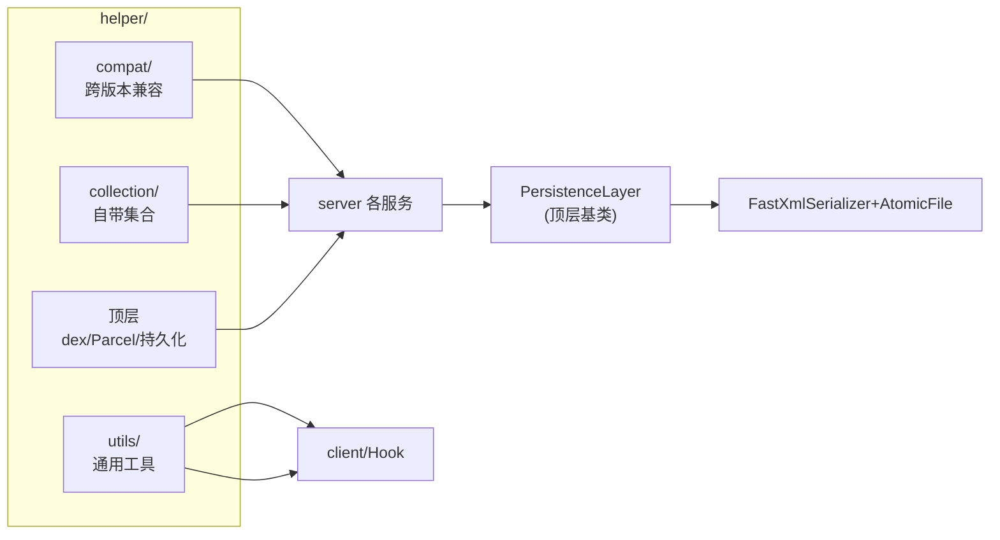

# helper · 工具与兼容层

::: tip 源码路径
[`src/main/java/com/lody/virtual/helper/`](https://github.com/android-security-engineer/VirtualXposed-skills/tree/vxp/VirtualApp/lib/src/main/java/com/lody/virtual/helper)
:::

VirtualXposed 的工具与兼容层，共 3 个子包 + 顶层 3 文件。跨版本兼容、集合实现、通用工具集中在这里。

## 子包

| 子包 | 文件数 | 职责 | 文档 |
| --- | --- | --- | --- |
| `compat/` | 14 | 跨版本兼容封装 | [compat](./helper-compat) |
| `collection/` | 7 | 自带集合实现（不依赖高版本 API） | [collection](./helper-collection) |
| `utils/` | 18 | 通用工具 | [utils](./helper-utils) |
| 顶层 | 3 | dex 优化/Parcel/持久化 | [顶层](./helper-top) |

## 顶层文件

| 文件 | 职责 |
| --- | --- |
| `ArtDexOptimizer.java` | ART dex 优化（dex2oat）封装 |
| `ParcelHelper.java` | Parcel 工具 |
| `PersistenceLayer.java` | 持久化层基类（被各 `*PersistenceLayer` 继承） |

`PersistenceLayer` 是 server 各服务持久化的基类：定义 `save`/`read` 的骨架，子类提供序列化逻辑（如 `PackagePersistenceLayer`/`DeviceInfoPersistenceLayer`）。

## helper 在系统中的位置

helper 是 server 与 client 共用的底层支撑：compat 抹平版本、collection 提供集合、utils 提供工具、顶层提供持久化骨架。
