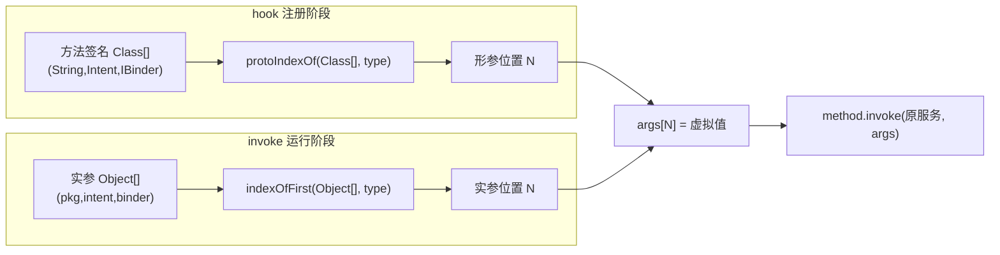

# ArrayUtils · 数组工具

::: tip 源码路径
[`src/main/java/com/lody/virtual/helper/utils/ArrayUtils.java`](https://github.com/android-security-engineer/VirtualXposed-skills/blob/vxp/VirtualApp/lib/src/main/java/com/lody/virtual/helper/utils/ArrayUtils.java)
:::

`ArrayUtils` 是 Hook 框架的数组操作工具，对应 AOSP 里的 `ArrayUtils`。VirtualXposed 的 Hook 大量发生在 `MethodProxy.invoke` 里——拿到原始参数数组 `Object[] args` 后，要按位置查找、判断类型、追加新参数。这个类把这些重复操作收敛成静态方法。

## 为什么需要它

一个 `MethodProxy` 的典型写法：

```java
@Override
public Object invoke(Object who, Method method, Object[] args) throws Throwable {
    // 在实参数组里按类型找到某个参数的下标
    int pkgIndex = ArrayUtils.indexOfFirst(args, String.class);
    if (pkgIndex >= 0) args[pkgIndex] = "com.target.pkg";
    return method.invoke(who, args);
}
```

没有 `ArrayUtils`，这段循环逻辑要每次手写。

## 方法清单

| 方法 | 作用 |
| --- | --- |
| `push(Object[] array, Object item)` | 追加一个元素，返回长度 +1 的新数组 |
| `contains(T[] array, T value)` | 对象数组是否包含某值 |
| `contains(int[] array, int value)` | `int` 数组是否包含某值 |
| `indexOf(T[] array, T value)` | 按值查找下标，找不到返回 `-1` |
| `protoIndexOf(Class<?>[] array, Class<?> type)` | 在**形参类型数组**里找某类型的下标 |
| `protoIndexOf(Class<?>[] array, Class<?> type, int sequence)` | 从 `sequence` 起找匹配 |
| `indexOfFirst(Object[] array, Class<?> type)` | 在**实参数组**里找第一个运行时类型匹配的项 |
| `indexOfObject(Object[] array, Class<?> type, int sequence)` | 实参数组里按顺序找第 N 个匹配 |

## protoIndexOf vs indexOfFirst

两者易混，区分点在「操作形参表还是实参表」：

- `protoIndexOf(Class<?>[] array, …)` —— 参数是 `Class[]`，即方法**声明**的形参类型表，用于 hook 注册阶段定位「目标方法签名里某参数在第几位」。
- `indexOfFirst(Object[] args, Class<?> type)` —— 参数是 `Object[]`，即运行时 `invoke` 收到的**实参**，用 `getClass()` 比对，用于运行时定位「这组实际参数里某类型值在第几位」。

例如 `startActivity` 系列在不同 Android 版本形参顺序不同，hook 时先用 `protoIndexOf` 确定位置再处理。

## 形参表 vs 实参表



## 关联

- 内部用 [`ObjectsCompat.equals`](../compat/objects-compat) 做空安全比较。
- 被各 `MethodProxy` 广泛使用，见[系统服务 Hook](/features/service-hook)。
