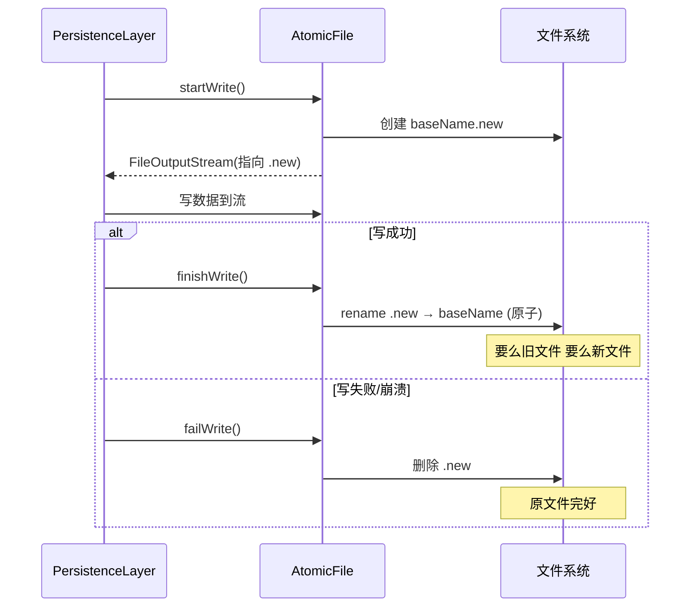

# AtomicFile · 原子文件

::: tip 源码路径
[`src/main/java/com/lody/virtual/helper/utils/AtomicFile.java`](https://github.com/android-security-engineer/VirtualXposed-skills/blob/vxp/VirtualApp/lib/src/main/java/com/lody/virtual/helper/utils/AtomicFile.java)
:::

`AtomicFile` 对应 AOSP 同名工具，提供「写临时文件 + rename」的原子写入语义，保证写一半崩溃不会损坏原文件。它本身不存数据，只是包了一个 `File` 并提供安全读写流程。

## API

| 方法 | 作用 |
| --- | --- |
| `AtomicFile(File baseName)` | 绑定目标文件 |
| `getBaseFile()` | 取底层 `File` |
| `startWrite()` | 开始写，返回 `FileOutputStream`（实际指向 `.new` 临时文件） |
| `finishWrite(FileOutputStream str)` | 写成功，把临时文件 rename 成正式文件 |
| `failWrite(FileOutputStream str)` | 写失败，删除临时文件 |
| `openRead()` / `readFully()` | 读取正式文件 |
| `delete()` | 删除正式与临时文件 |
| `truncate()` | 清空文件 |

## 原子写入流程

```
startWrite()  →  写到  baseName.new
finishWrite() →  baseName.new  rename→  baseName   （原子操作）
failWrite()   →  删除  baseName.new
```

`rename` 在同一文件系统上是原子的，所以要么看到完整的旧文件、要么看到完整的新文件，绝不会出现半新半旧的损坏态。

## 用途

各 `PersistenceLayer`（见 [helper 顶层](../helper-top)）持久化关键配置时用它：

- `PackagePersistenceLayer` —— 虚拟安装的包列表
- `DeviceInfoPersistenceLayer` —— 伪造的设备信息
- 其他账户/权限配置

server 进程崩溃重启后能读到上一次完整状态。

## 原子写入时序



`rename` 在同一文件系统上是原子的——绝不会出现半新半旧的损坏态。

::: tip openAppend 已废弃
`openAppend` 标了 `@Deprecated`，因为追加写破坏原子性——追加过程中崩溃会留下不完整尾部。
:::

## 关联

- 持久化层见 [helper 顶层](../helper-top)。
- 与 [`FastXmlSerializer`](./fast-xml-serializer) 配合序列化。
