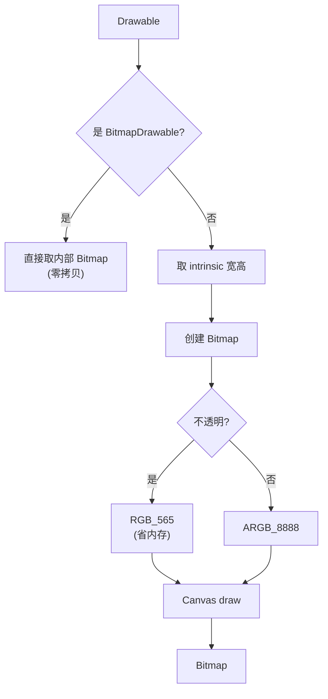

# BitmapUtils · 位图工具

::: tip 源码路径
[`src/main/java/com/lody/virtual/helper/utils/BitmapUtils.java`](https://github.com/android-security-engineer/VirtualXposed-skills/blob/vxp/VirtualApp/lib/src/main/java/com/lody/virtual/helper/utils/BitmapUtils.java)
:::

`BitmapUtils` 只做一件事：把 `Drawable` 转成 `Bitmap`。虚拟化引擎在展示应用图标、通知图标、角标等场景里频繁需要从 Drawable 取位图。

## 方法

| 方法 | 作用 |
| --- | --- |
| `drawableToBitmap(Drawable drawable)` | 把任意 `Drawable` 转成 `Bitmap` |

## 实现细节

转换分两条路径：

- 若 `drawable` 本身是 `BitmapDrawable`，直接取其内部 `Bitmap` 返回，零拷贝。
- 否则按 Drawable 的内在宽高创建一张 `Bitmap`，用 `Canvas` 把 Drawable 画上去。像素格式按不透明度选择：不透明用 `RGB_565`（省内存），否则用 `ARGB_8888`。

::: warning 与 DrawableUtils 的关系
[`DrawableUtils.drawableToBitMap`](./drawable-utils) 是同一逻辑的另一个副本（方法名多了 `Bit`、加了 `null` 判空）。两者并存属历史遗留，新代码应优先用带判空的 `DrawableUtils`。
:::

## 关联

- 应用图标渲染：`VAppManagerService` 取出 `Drawable` 图标后经此工具转 `Bitmap` 缓存。
- 见 [包管理](/features/package-manager) 中图标处理。

## Drawable 转 Bitmap 决策

