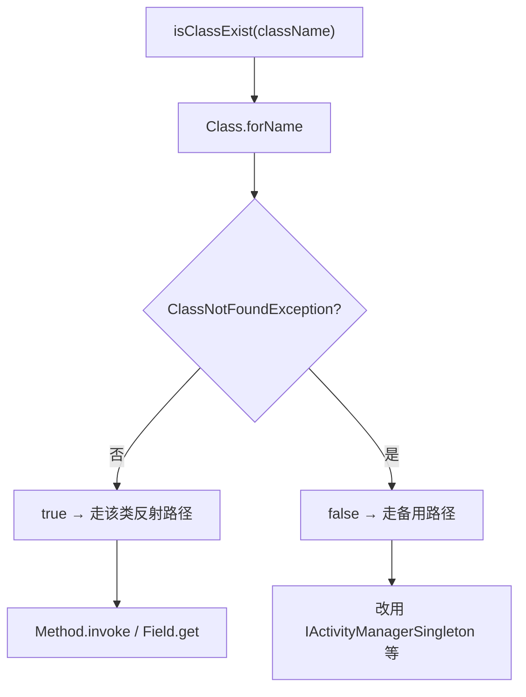

# ClassUtils · 类型工具

::: tip 源码路径
[`src/main/java/com/lody/virtual/helper/utils/ClassUtils.java`](https://github.com/android-security-engineer/VirtualXposed-skills/blob/vxp/VirtualApp/lib/src/main/java/com/lody/virtual/helper/utils/ClassUtils.java)
:::

`ClassUtils` 处理反射场景下两类杂活：判断类是否存在、修正可空的基本类型参数。注意它与 [mirror 反射框架](/features/mirror-reflection) 不同——后者绑定具体的隐藏类做结构化镜像，`ClassUtils` 是通用反射辅助，不绑定任何具体类。

## 方法

| 方法 | 作用 |
| --- | --- |
| `isClassExist(String className)` | `Class.forName` 探测类是否存在，捕获 `ClassNotFoundException` |
| `fixArgs(Class<?>[] types, Object[] args)` | 把 `args` 里为 `null` 的基本类型槽位填上默认值 |

## fixArgs 的用途

反射调用方法时，如果形参是基本类型（`int`/`boolean`），而传入的 `args[i]` 是 `null`，会抛 `IllegalArgumentException`。`fixArgs` 遍历形参类型表，把 `null` 的基本类型槽补成：

- `int.class` → `0`
- `boolean.class` → `false`

这在 hook 代理方法里很常见——某些参数在特定路径下为 `null`，但被代理的真实方法签名要求基本类型，必须先修再调。

## isClassExist 的用途

跨 Android 版本反射隐藏 API 时，目标类名因版本而异（如 `ActivityManagerNative` 在高版本消失）。先用 `isClassExist` 探测，再决定用哪条反射路径，避免直接 `Class.forName` 抛异常中断流程：



```java
if (ClassUtils.isClassExist("android.app.ActivityManagerNative")) {
    // 走旧版反射路径
} else {
    // 走 IActivityManagerSingleton 路径
}
```

## 关联

- `fixArgs` 配合 [mirror 反射框架](/features/mirror-reflection) 使用。
- 跨版本反射见 [`mirror/`](/reference/mirror/) 各镜像类。
