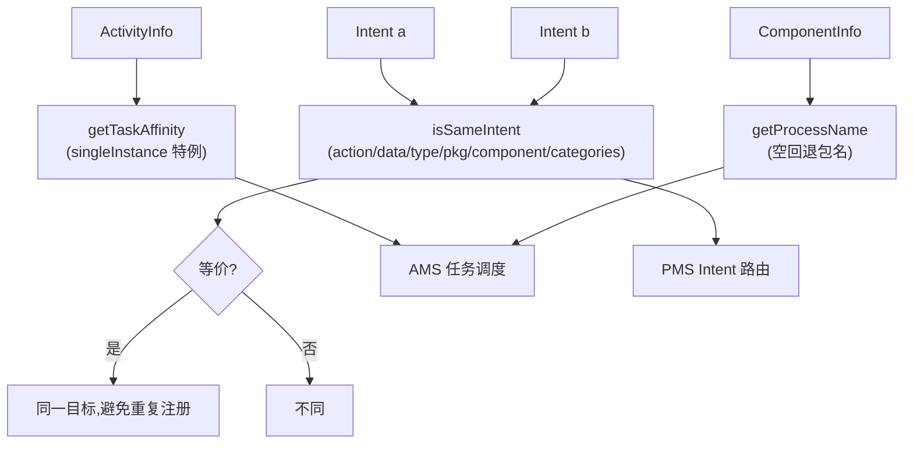

# ComponentUtils · 组件工具

::: tip 源码路径
[`src/main/java/com/lody/virtual/helper/utils/ComponentUtils.java`](https://github.com/android-security-engineer/VirtualXposed-skills/blob/vxp/VirtualApp/lib/src/main/java/com/lody/virtual/helper/utils/ComponentUtils.java)
:::

`ComponentUtils` 处理四大组件（Activity/Service/Receiver/Provider）的元信息计算：任务亲和、进程名、Intent 等价判断、PendingIntent 组件归属等。它是 [PMS](../../server/pm) Intent 路由和 [AMS](../../server/am) 任务调度的底层助手。

## 核心方法

| 方法 | 作用 |
| --- | --- |
| `getTaskAffinity(ActivityInfo info)` | 计算Activity 的 taskAffinity，处理 `singleInstance` 特例 |
| `isSameIntent(Intent a, Intent b)` | 判断两个 Intent 是否等价（action/data/type/pkg/component/categories 全比） |
| `getProcessName(ComponentInfo info)` | 取组件所在进程名，为空时回退到包名并回填 |
| `isSameComponent(ComponentInfo first, ComponentInfo second)` | 判断两个组件是否同一 |

## getTaskAffinity 的特殊处理

普通 Activity 的 taskAffinity 由 `ActivityInfo.taskAffinity` 或 `ApplicationInfo.taskAffinity` 决定。但 `singleInstance` 启动模式的 Activity 任务亲和要特殊化——返回 `"-SingleInstance-" + pkg/name` 前缀，确保它独占任务栈，与 VirtualXposed 的 Stub 任务栈管理配合。

## isSameIntent 的判定逻辑

逐项短路比较：action、data、type、包名（无显式包名时从 component 推断）、component、categories。任何一项不等就返回 `false`。用于判断「两个 PendingIntent 是不是指向同一目标」，避免重复注册。

## 组件元信息判定流

## 关联

- Stub 模式下真实组件信息要和 Stub 记录匹配，见 [Stub Activity](/features/stub-activity)。
- 进程名决定组件跑在哪个虚拟进程，见 [进程模型](/architecture/process-model)。
- 配合 `StubPendingActivity`/`StubPendingService`/`StubPendingReceiver` 处理 PendingIntent。
