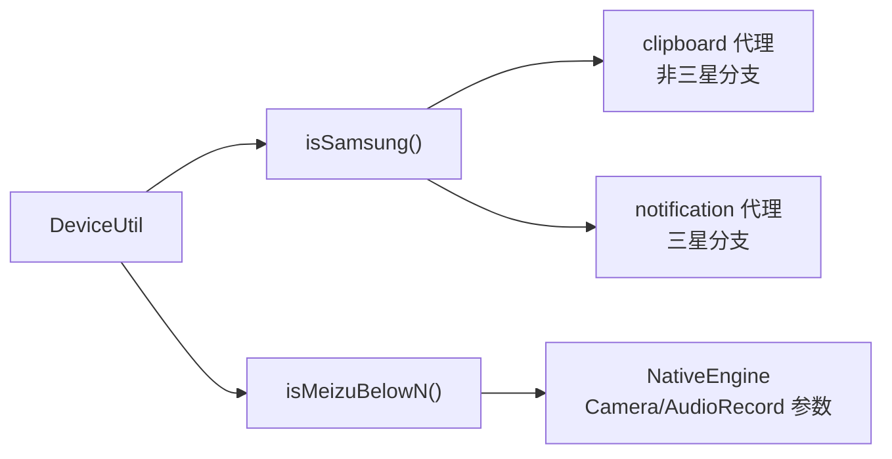

# DeviceUtil · 设备判定

::: tip 源码路径
[`src/main/java/com/lody/virtual/helper/utils/DeviceUtil.java`](https://github.com/android-security-engineer/VirtualXposed-skills/blob/vxp/VirtualApp/lib/src/main/java/com/lody/virtual/helper/utils/DeviceUtil.java)
:::

设备厂商/型号判定工具，用于版本和厂商特殊处理。

## 关键 API

从源码提取的真实方法：

| 方法 | 作用 |
| --- | --- |
| `isSamsung()` | 是否三星 |
| `isMeizuBelowN()` | 是否魅族且 Android < N |

## 用途

各 Hook 在不同厂商 ROM 上行为有差异，`DeviceUtil` 提供判定，按厂商分支处理。真实调用方：

| 方法 | 调用方 | 用途 |
| --- | --- | --- |
| `isSamsung()` | [clipboard 代理](../../proxies/clipboard) | 非三星时走某剪贴板分支 |
| `isSamsung()` | [notification 代理](../../proxies/notification) | 三星通知特殊处理 |
| `isMeizuBelowN()` | `NativeEngine.launchEngine` | 魅族旧版 Camera/AudioRecord 参数差异 |

## 厂商分支处理

与 [`OSUtils`](./os-utils) 的关系：`OSUtils` 读 `build.prop` 判 EMUI/MIUI/Flyme，`DeviceUtil` 判具体型号（如三星），两者互补。
