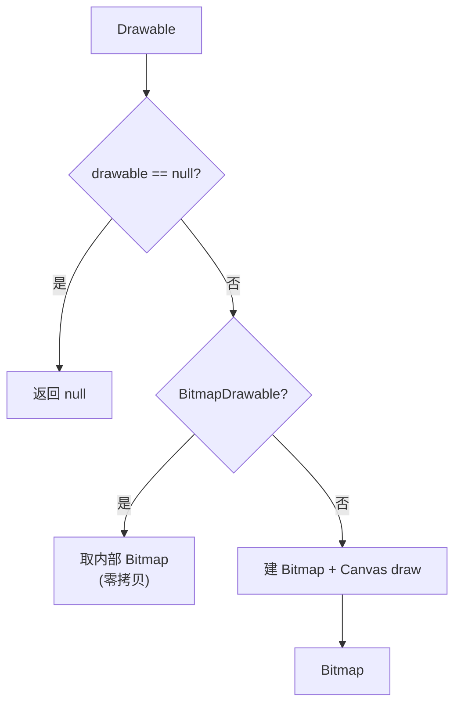

# DrawableUtils · Drawable 工具

::: tip 源码路径
[`src/main/java/com/lody/virtual/helper/utils/DrawableUtils.java`](https://github.com/android-security-engineer/VirtualXposed-skills/blob/vxp/VirtualApp/lib/src/main/java/com/lody/virtual/helper/utils/DrawableUtils.java)
:::

`DrawableUtils` 提供 `Drawable` → `Bitmap` 转换，配合 [`BitmapUtils`](./bitmap-utils) 处理虚拟 App 图标。它是 `BitmapUtils` 的带判空版本。

## 方法

| 方法 | 作用 |
| --- | --- |
| `drawableToBitMap(Drawable drawable)` | 把 `Drawable` 转成 `Bitmap`，`null` 入参返回 `null` |

## 实现细节

- `drawable == null` → 直接返回 `null`（这是它比 [`BitmapUtils`](./bitmap-utils) 多的判空）。
- `BitmapDrawable` → 取内部 `Bitmap`，零拷贝。
- 其他 Drawable → 按内在宽高建 `Bitmap`，`Canvas` 绘制；不透明用 `RGB_565`，否则 `ARGB_8888`。

::: tip 方法名注意
方法名是 `drawableToBitMap`（`Bit` 大写、`Map` 大写），不是常见的 `drawableToBitmap`。调用时注意大小写。
:::

## 关联

- 图标缓存与展示，见 [包管理](/features/package-manager)。
- 与 [`BitmapUtils`](./bitmap-utils) 逻辑同源，二选一即可。

## 带判空的转换流程

