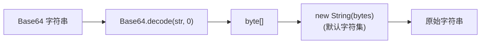

# EncodeUtils · 编码工具

::: tip 源码路径
[`src/main/java/com/lody/virtual/helper/utils/EncodeUtils.java`](https://github.com/android-security-engineer/VirtualXposed-skills/blob/vxp/VirtualApp/lib/src/main/java/com/lody/virtual/helper/utils/EncodeUtils.java)
:::

`EncodeUtils` 是极简的 Base64 解码工具，目前只暴露一个解码方法。

## 方法

| 方法 | 作用 |
| --- | --- |
| `decode(String base64)` | 把 Base64 字符串解码回原始字符串 |

## 实现

```java
public static String decode(String base64) {
    return new String(Base64.decode(base64, 0));
}
```

内部用 `android.util.Base64.decode`，flag `0` 表示默认（URL_SAFE 等都不开）。解码出的 `byte[]` 用平台默认字符集转 `String`。

## 用途

框架内部少量 Base64 持久化字段（如某些配置项、跨进程传递的二进制指纹）的解码。这是个轻量工具，复杂的编解码场景应直接用 `Base64`。

## 解码流



## 关联

- 与签名/哈希相关见 [`MD5Utils`](./md5-utils)。
