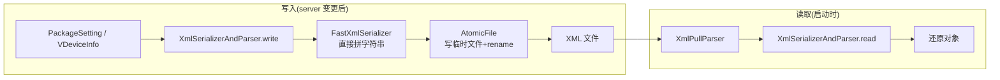

# FastXmlSerializer · 快速 XML 序列化

::: tip 源码路径
[`src/main/java/com/lody/virtual/helper/utils/FastXmlSerializer.java`](https://github.com/android-security-engineer/VirtualXposed-skills/blob/vxp/VirtualApp/lib/src/main/java/com/lody/virtual/helper/utils/FastXmlSerializer.java)
:::

`FastXmlSerializer` 实现 `XmlSerializer` 接口，对应 AOSP 同名类。它是一个不依赖 `XmlPullParserFactory`、直接往 `OutputStream`/`Writer` 写的轻量 XML 序列化器，比标准实现快，适合频繁持久化小配置。

## 为什么不用标准 XmlSerializer

VirtualXposed 的 server 进程在每次包列表/设备信息变更后都要落盘序列化。标准 `XmlPullParserFactory` 走 SPI 查找、有反射开销；`FastXmlSerializer` 是纯写、零依赖、直接拼字符串刷盘，延迟更低。

## 主要方法

实现 `XmlSerializer` 全套：`startDocument`/`endDocument`、`startTag`/`endTag`、`attribute`、`text`、`comment`、`cdsect`、`entityRef`、`processingInstruction`、`flush`、`setOutput` 等。

## 用途

`PackagePersistenceLayer` / `DeviceInfoPersistenceLayer` 把 `PackageSetting` / `VDeviceInfo` 等结构序列化成 XML 落盘时，用 `FastXmlSerializer` 配合 [`XmlSerializerAndParser`](./xml-serializer-and-parser) 接口写入，读取时再用 `XmlPullParser` 解析。

## 持久化读写流

## 关联

- 持久化层见 [helper 顶层](../helper-top)。
- 写入目标文件经 [`AtomicFile`](./atomic-file) 保证原子性。
- 序列化协议定义见 [`XmlSerializerAndParser`](./xml-serializer-and-parser)。
