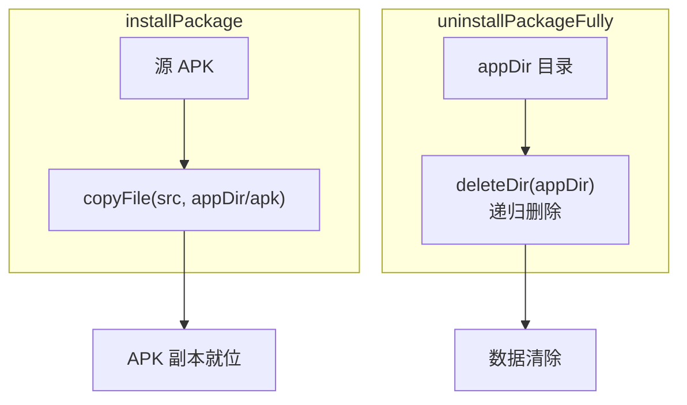

# FileUtils · 文件操作

::: tip 源码路径
[`src/main/java/com/lody/virtual/helper/utils/FileUtils.java`](https://github.com/android-security-engineer/VirtualXposed-skills/blob/vxp/VirtualApp/lib/src/main/java/com/lody/virtual/helper/utils/FileUtils.java)
:::

文件/目录操作工具，[PMS 安装](../../server/pm) 时大量使用。

## 关键 API

从源码提取的真实方法：

| 方法 | 作用 |
| --- | --- |
| `copyFile(File, File)` / `copyFile(String, String)` | 复制文件（安装时复制 APK） |
| `copyDir(src, target)` | 递归复制目录 |
| `deleteDir(File)` / `deleteDir(File, Set<File> ignores)` / `deleteDir(String)` | 递归删除目录（卸载时清数据，可带忽略集） |
| `writeToFile(InputStream, File)` / `writeToFile(byte[], File)` | 流/字节数组写文件 |
| `writeParcelToFile(Parcel, File)` | Parcel 序列化落盘 |
| `toByteArray(InputStream)` | 流转字节数组 |
| `createSymlink(old, new)` / `isSymlink(File)` | 符号链接创建/判定 |
| `chmod(path, mode)` | 改文件权限 |
| `getFileFromUri(Context, Uri)` | URI 解析为本地文件路径（外部 APK 安装用） |
| `isValidExtFilename(name)` / `buildValidExtFilename(name)` | 外部文件名校验/构造 |
| `peekInt(bytes, offset, endian)` | 按字节序读 int |
| `closeQuietly(Closeable)` | 静默关闭 |

内嵌 `FileMode` 接口定义权限常量。

## 用途

`VAppManagerService.installPackage` 复制 APK、`uninstallPackageFully` 删除 appDir 时调用；外部 APK 安装时 `getFileFromUri` 解析选择器返回的 URI。

## 安装/卸载文件操作

