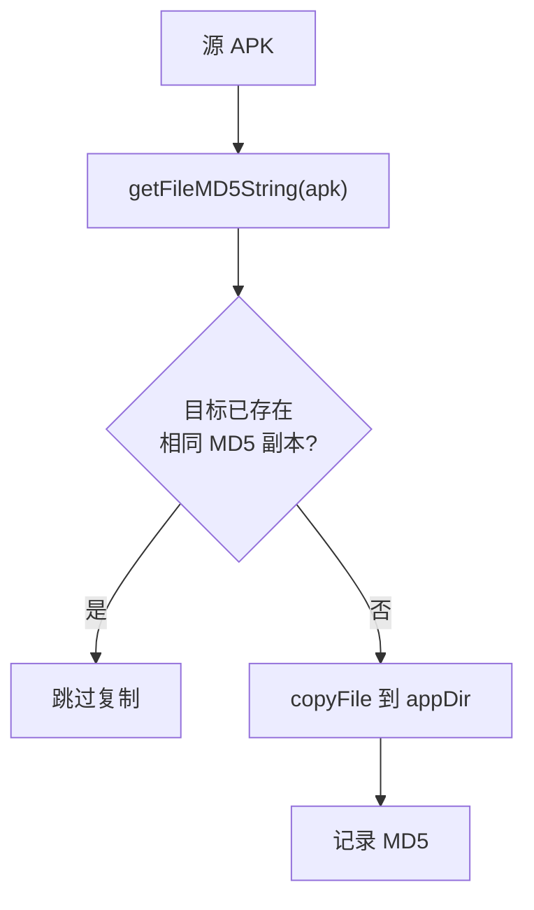
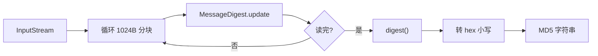

# MD5Utils · MD5 哈希

::: tip 源码路径
[`src/main/java/com/lody/virtual/helper/utils/MD5Utils.java`](https://github.com/android-security-engineer/VirtualXposed-skills/blob/vxp/VirtualApp/lib/src/main/java/com/lody/virtual/helper/utils/MD5Utils.java)
:::

`MD5Utils` 计算文件/流的 MD5 摘要，用于校验 APK 完整性、判断两个文件内容是否一致（避免重复安装/复制）。

## 方法

| 方法 | 作用 |
| --- | --- |
| `getFileMD5String(File file)` | 计算文件的 MD5（按路径打开 `FileInputStream`） |
| `getFileMD5String(InputStream in)` | 计算流的 MD5，读完自动关闭流 |
| `compareFiles(File one, File two)` | 比较两文件内容是否一致（同路径直接 true，否则比 MD5） |

## 实现要点

- `MessageDigest` 实例在静态块里初始化一次（`MD5` 算法），**全局共享且非线程安全**——并发调用 `getFileMD5String` 可能错乱。这是已知的历史实现缺陷，框架内部调用多为单线程安装流程，未触发问题。
- 按 1024 字节分块 `update`，避免大文件一次性占用内存。
- 摘要 `byte[]` 转 hex 小写字符串（`HEX_DIGITS` 表）。
- `compareFiles` 先比绝对路径（同一文件直接 `true`，省一次读盘），再算两边 MD5 比字符串。

## 用途场景

- **安装去重**：`VAppManagerService` 安装前算源 APK 的 MD5，若目标已存在相同 MD5 的副本则跳过复制。
- **完整性校验**：虚拟存储里 APK 副本损坏检测。

## 安装去重流程

::: warning 非线程安全
`MessageDigest` 全局共享，并发调用可能错乱。框架内部调用多为单线程安装流程，未触发问题。
:::

## 关联

- 见 [包管理](/features/package-manager) 安装流程。
- [IO 重定向](/features/io-redirect) 中文件复制路径。
