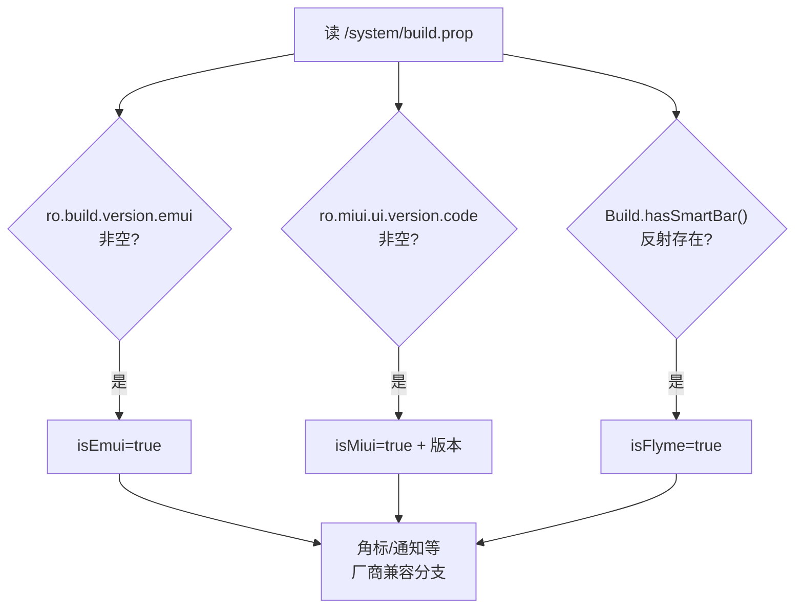

# OSUtils · 系统 ROM 识别

::: tip 源码路径
[`src/main/java/com/lody/virtual/helper/utils/OSUtils.java`](https://github.com/android-security-engineer/VirtualXposed-skills/blob/vxp/VirtualApp/lib/src/main/java/com/lody/virtual/helper/utils/OSUtils.java)
:::

`OSUtils` 识别当前设备跑的是哪家厂商 ROM（华为 EMUI / 小米 MIUI / 魅族 Flyme），用于针对厂商差异做兼容分支。它是单例，构造时一次性读取 `build.prop`。

## 识别原理

构造函数读取 `/system/build.prop`（`Environment.getRootDirectory()/build.prop`）到 `Properties`，按 key 探测：

| ROM | 探测 key |
| --- | --- |
| EMUI（华为） | `ro.build.version.emui` 非空 |
| MIUI（小米） | `ro.miui.ui.version.code` / `.name` / `ro.miui.internal.storage` 任一非空 |
| Flyme（魅族） | 反射 `Build.hasSmartBar()` 方法存在 |

::: tip 为什么用 build.prop
厂商定制信息不在标准 `Build` 字段里，只能从 `build.prop` 的 property 读。读取失败（文件不存在/无权限）时三个标志都保持 `false`，不影响流程。
:::

## API

| 方法 | 作用 |
| --- | --- |
| `getInstance()` | 取单例 |
| `isEmui()` | 是否华为 EMUI |
| `isMiui()` | 是否小米 MIUI |
| `isFlyme()` | 是否魅族 Flyme |
| `getMiuiVersion()` | MIUI 版本号字符串 |

## 用途

厂商 ROM 在角标、通知、权限、Stub Activity 栈管理等处有差异。例如角标协议各家不同（见 [badger](../../client/badger)），通知栏渲染 MIUI 有特殊处理。`OSUtils` 让这些分支可读。

## ROM 识别决策

读取失败时三个标志保持 `false`，不影响流程。与 [`BuildCompat`](../compat/build-compat) 互补：`BuildCompat` 管 API 等级，`OSUtils` 管厂商。

## 关联

- 角标适配见 [`client/badger`](../../client/badger)。
- 与 [`BuildCompat`](../compat/build-compat) 互补：前者管厂商、后者管 API 等级。
