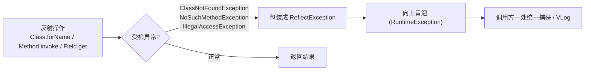

# ReflectException · 反射异常

::: tip 源码路径
[`src/main/java/com/lody/virtual/helper/utils/ReflectException.java`](https://github.com/android-security-engineer/VirtualXposed-skills/blob/vxp/VirtualApp/lib/src/main/java/com/lody/virtual/helper/utils/ReflectException.java)
:::

`ReflectException` 是 `RuntimeException` 的子类，统一包装反射操作中抛出的受检异常，让调用方不必处处 `try/catch`。

## 构造方法

| 构造 | 用途 |
| --- | --- |
| `ReflectException(String message, Throwable cause)` | 带自定义消息 + 原始异常 |
| `ReflectException(Throwable cause)` | 仅包装原始异常 |

## 设计意图

Java 反射 API（`Class.forName`、`Method.invoke`、`Field.get` 等）抛 `ClassNotFoundException`、`NoSuchMethodException`、`IllegalAccessException` 等受检异常。在 hook 框架里，反射失败往往意味着环境不兼容，不该在每个调用点铺满 `try/catch`。

`Reflect` 工具（`Reflect.java`，本目录下另一个反射门面）和 [mirror](/features/mirror-reflection) 绑定隐藏类时，把底层受检异常统一包成 `ReflectException` 抛出。这样上层要么让它冒泡中断、要么在一处统一捕获记录，代码更干净。

## 异常包装流

## 关联

- [mirror 反射框架](/features/mirror-reflection)：镜像绑定失败抛此异常。
- 配合 [`ClassUtils`](./class-utils) 的跨版本反射。
