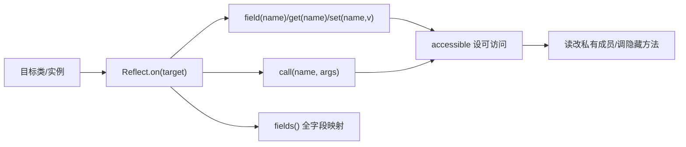

# Reflect · 通用反射工具

::: tip 源码路径
[`src/main/java/com/lody/virtual/helper/utils/Reflect.java`](https://github.com/android-security-engineer/VirtualXposed-skills/blob/vxp/VirtualApp/lib/src/main/java/com/lody/virtual/helper/utils/Reflect.java)
:::

`Reflect` 是一个**通用反射工具类**，提供链式 API 访问任意类的字段/方法/构造——不依赖 `@hide` 解封，只是把 JDK 反射的繁琐调用包成流畅接口。被 `VClientImpl`/`ResolverActivity`/`HackAppUtils`/`libcore MethodProxies`/`WifiManagerStub` 等广泛使用。

::: warning 不要与隐藏 API 解封混淆
Android 9+ 的隐藏 API 解封由外部库 `me.weishu.reflection.Reflection`（[`me.weishu/reflection`](https://github.com/tiann/FreeReflection)）提供，`VirtualCore.startup()` 调 `Reflection.unseal(context)` 完成解封——**那是另一个类，不是本文件**。本 `Reflect` 工具类本身不解封隐藏 API，只在解封之后提供便捷反射访问。
:::

## 关键 API

链式入口与字段/方法访问：

| 方法 | 作用 |
| --- | --- |
| `on(String name)` / `on(String, ClassLoader)` / `on(Class)` / `on(Object)` | 创建反射句柄（按类名/类对象/实例） |
| `field(name)` / `fields()` | 取字段；`fields()` 返回所有字段的 Reflect 映射 |
| `get()` / `get(name)` | 取实例值 / 取字段值 |
| `set(name, value)` | 设字段值 |
| `call(name)` / `call(name, args...)` | 调方法 |
| `exactMethod(name, types)` | 按精确签名取 Method |
| `accessible(AccessibleObject)` | 静态工具：设可访问并返回 |
| `wrapper(Class)` | 基本类型 ↔ 包装类转换 |

## 用途

各 Hook 用它快速读改目标对象的私有字段、调用隐藏方法，避免每次都写完整的 `Class.forName` + `getDeclaredField` + `setAccessible` 三段式。详见 [反射框架 mirror](../../../features/mirror-reflection)。

## 反射访问流程

`accessible` 静态方法把 `setAccessible(true)` 的样板代码收敛成一行，是链式访问能穿透 private 的基础。
