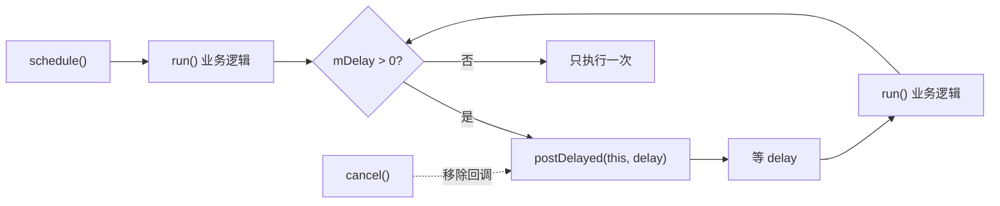

# SchedulerTask · 调度任务

::: tip 源码路径
[`src/main/java/com/lody/virtual/helper/utils/SchedulerTask.java`](https://github.com/android-security-engineer/VirtualXposed-skills/blob/vxp/VirtualApp/lib/src/main/java/com/lody/virtual/helper/utils/SchedulerTask.java)
:::

`SchedulerTask` 是抽象 `Runnable`，封装「按固定延迟周期执行」的任务调度，内部基于 `Handler`。

## 用法

```java
SchedulerTask task = new SchedulerTask(handler, 5000L) {
    @Override
    public void run() {
        // 每次执行的业务逻辑
    }
};
task.schedule();  // 启动
task.cancel();    // 停止
```

## API

| 方法 | 作用 |
| --- | --- |
| `SchedulerTask(Handler handler, long delay)` | 绑定 Handler 与周期延迟（毫秒） |
| `schedule()` | 投递首次执行 |
| `cancel()` | 从 Handler 移除待执行回调 |

## 机制

内部 `mInnerRunnable` 在 `run()` 里先调用子类的 `run()`（业务逻辑），再判断 `mDelay > 0` 时用 `mHandler.postDelayed(this, mDelay)` 安排下一次。

::: warning 是 fixed-delay 不是 fixed-rate
这是「上一次执行结束后等 `delay` 再跑下一次」的固定延迟语义，类似 `ScheduledExecutorService.scheduleWithFixedDelay`。若某次执行耗时长，周期会整体后移，不会追赶。`mDelay <= 0` 时只执行一次。
:::

## 固定延迟周期

```mermaid
gantt
  title fixed-delay 时间线(执行耗时不影响周期对齐,整体后移)
  dateFormat X
  axisFormat %s
  section 任务
  执行1 :0, 2
  等待 :2, 5
  执行2 :5, 7
  等待 :7, 10
  执行3 :10, 12
```





## 用途

- 虚拟定位的周期性位置更新推送。
- 角标/通知的周期刷新。

## 关联

- 虚拟定位服务见 [`server/location`](../../server/location)。
