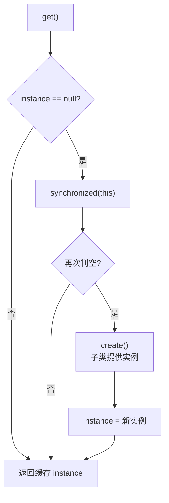

# Singleton · 单例基类

::: tip 源码路径
[`src/main/java/com/lody/virtual/helper/utils/Singleton.java`](https://github.com/android-security-engineer/VirtualXposed-skills/blob/vxp/VirtualApp/lib/src/main/java/com/lody/virtual/helper/utils/Singleton.java)
:::

`Singleton<T>` 是抽象泛型单例基类，对应 AOSP 同名模式。子类实现 `create()` 提供实例，调用方用 `get()` 取**线程安全、懒加载**的唯一实例。

## API

```java
public abstract class Singleton<T> {
    protected abstract T create();   // 子类提供实例
    public final T get();            // 懒加载 + 双检锁
}
```

`get()` 内部用 `synchronized (this)` 保证多线程下只 `create()` 一次，之后直接返回缓存实例。

## 用途

VirtualXposed 大量用 `Singleton` 管理需要全局唯一的对象：

- **server 端服务**：`VActivityManagerService`、`VPackageManagerService` 等 `get()` 出唯一服务实例。
- **client 端 IPC 代理**：`VActivityManager`、`VPackageManager` 等 `V*Manager` 通过 `Singleton` 持有跨进程代理，首次 `get()` 时建立 binder 连接。

```java
public static Singleton<VActivityManager> gDefault =
    new Singleton<VActivityManager>() {
        @Override
        protected VActivityManager create() {
            return new VActivityManager();
        }
    };
// 使用：VActivityManager.get()
```

::: tip 与静态字段的区别
直接 `static final` 字段会在类加载时就初始化，可能过早（此时 binder 基建未必就绪）。`Singleton` 推迟到首次 `get()`，时机可控。
:::

## 懒加载与双检锁



推迟到首次 `get()`——server 服务/IPC 代理在真正被调用时才建立，避免类加载阶段 binder 基建未就绪的问题。

## 关联

- server 服务见 [`server/`](../../server/)。
- client IPC 代理见 [`client/ipc`](../../client/ipc)。
