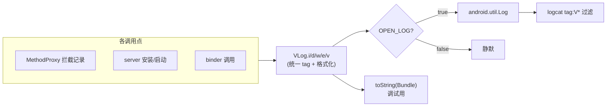

# VLog · 日志

::: tip 源码路径
[`src/main/java/com/lody/virtual/helper/utils/VLog.java`](https://github.com/android-security-engineer/VirtualXposed-skills/blob/vxp/VirtualApp/lib/src/main/java/com/lody/virtual/helper/utils/VLog.java)
:::

`VLog` 是 VirtualXposed 的统一日志门面，封装 `android.util.Log`。所有框架内部日志都走它，便于在 logcat 里用统一 tag 过滤、必要时一键关闭。

## API

| 方法 | 作用 |
| --- | --- |
| `OPEN_LOG` | 全局开关，置 `false` 后日志静默 |
| `i/d/w/e/v(tag, msg, Object... format)` | 各级别日志，`msg` 支持 `%s` 格式化 |
| `e(tag, Throwable e)` | 打印异常栈 |
| `toString(Bundle bundle)` | 把 `Bundle` 转成可读字符串（调试用） |
| `getStackTraceString(Throwable tr)` | 取异常栈字符串 |
| `printStackTrace(String tag)` | 打印当前调用栈 |

## 设计要点

- **格式化参数**：`i/d/w/e/v` 都带 `Object... format`，内部用 `String.format` 拼接，省去调用方手动拼字符串。
- **统一 tag**：调用方传 tag，框架内约定用 `VirtualXposed` 或子系统名，logcat 里 `tag:V*` 即可隔离本框架日志。
- **Bundle 调试**：`toString(Bundle)` 反射读取所有 key，排错时把跨进程 Bundle 内容打出来。

## 用途

贯穿全框架。Hook 代理记录被拦截的方法调用、server 记录安装/启动流程、IPC 记录 binder 调用，都用 `VLog`。

## 日志门面位置

`OPEN_LOG` 一键关闭所有框架日志，避免 release 包泄漏调试信息。

## 关联

- 异常包装见 [`ReflectException`](./reflect-exception)。
