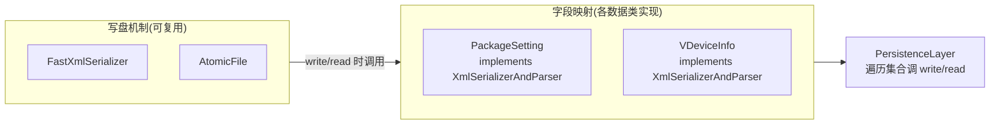

# XmlSerializerAndParser · XML 序列化协议

::: tip 源码路径
[`src/main/java/com/lody/virtual/helper/utils/XmlSerializerAndParser.java`](https://github.com/android-security-engineer/VirtualXposed-skills/blob/vxp/VirtualApp/lib/src/main/java/com/lody/virtual/helper/utils/XmlSerializerAndParser.java)
:::

`XmlSerializerAndParser<T>` 是一个泛型接口，定义「把对象写成 XML」和「从 XML 读回对象」的双向协议。让数据类各自实现这个接口后，持久化层就能用统一流程序列化任意类型。

## 接口定义

```java
public interface XmlSerializerAndParser<T> {
    void write(T obj, XmlSerializer serializer) throws IOException;
    T read(XmlPullParser parser) throws IOException, XmlPullParserException;
}
```

- `write` —— 把 `obj` 的字段写成 XML 标签/属性。
- `read` —— 从 `XmlPullParser` 当前位置读回一个 `T`。

## 用途

各持久化层（见 [helper 顶层](../helper-top)）序列化数据时：

1. `FastXmlSerializer` 负责把字节往流里写；
2. 数据类（如 `PackageSetting`、`VDeviceInfo`）实现 `XmlSerializerAndParser`，决定**写什么字段、用什么标签名**；
3. 持久化层遍历集合，对每个元素调 `write`；读取时对每个标签调 `read` 还原。

这样把「写盘机制」和「字段映射」解耦，新增一种持久化数据只要实现接口，不用改持久化层。

## 机制与字段映射解耦



新增持久化类型只需实现接口，不动写盘机制与持久化层。

## 关联

- 写盘机制见 [`FastXmlSerializer`](./fast-xml-serializer)。
- 原子落盘见 [`AtomicFile`](./atomic-file)。
- 持久化层见 [helper 顶层](../helper-top)。
