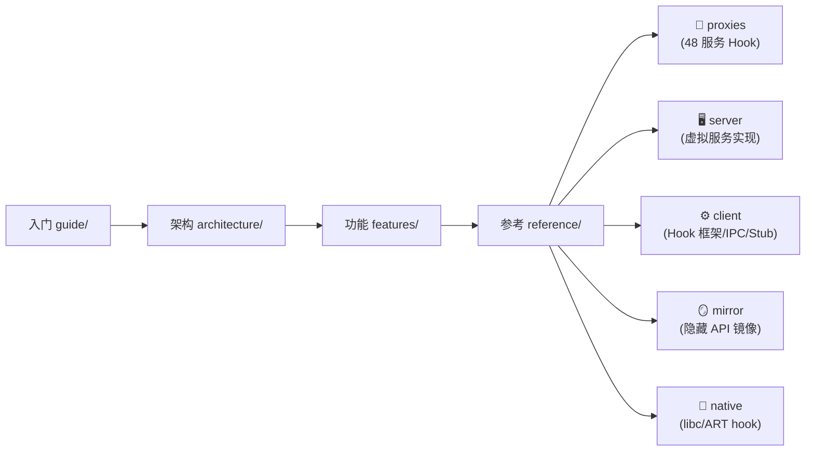

# 源码参考索引

::: tip 教学定位
本章节是 VirtualXposed 的**逐模块源码参考**。前面 [架构原理](../architecture/overview) 和 [功能详解](../features/app-virtualization) 讲的是"是什么、为什么"，本章节讲的是"具体每个包/类做什么"——把代码库拆到文件粒度，每个代码模块对应一篇文档，方便按图索骥地阅读源码。

VirtualXposed 的 `lib` 模块共有 **481 个 Java 文件 + 96 个 native 源文件**，按职责可归为六大组：
:::

| 分组 | 路径 | 文件数 | 说明 |
| --- | --- | --- | --- |
| 🔌 服务代理 | [`client/hook/proxies/`](./proxies/) | ~80 | 48 个系统服务的客户端 Hook 注入 |
| 🖥️ 虚拟服务 | [`server/`](./server/) | ~90 | server 进程里重新实现的系统服务 |
| ⚙️ 客户端基建 | [`client/`](./client/) | ~60 | Hook 框架、IPC 桥、Stub、修复器 |
| 🪞 反射镜像 | [`mirror/`](./mirror/) | ~120 | Android 隐藏 API 的类型安全镜像 |
| 🧰 工具与数据 | [`helper/`](./helper/) · [`remote/`](./remote/) | ~50 | 兼容工具、集合、跨进程数据类 |
| 🦀 Native 层 | [`jni/`](./native/) | 90 | libc hook / ART hook / inline hook |

## 阅读路线

- 想看"某个系统服务怎么被 Hook 的" → [服务代理 proxies](./proxies/)
- 想看"虚拟 AMS/PMS 内部怎么实现的" → [虚拟服务 server](./server/)
- 想看"Hook 框架的基类怎么工作" → [客户端基建 client](./client/)
- 想看"反射怎么访问 Build.SERIAL 等隐藏字段" → [反射镜像 mirror](./mirror/)
- 想看"libc open 怎么被改写的" → [Native 层](./native/)

每篇文档都会标注对应的源码路径，便于对照阅读。
