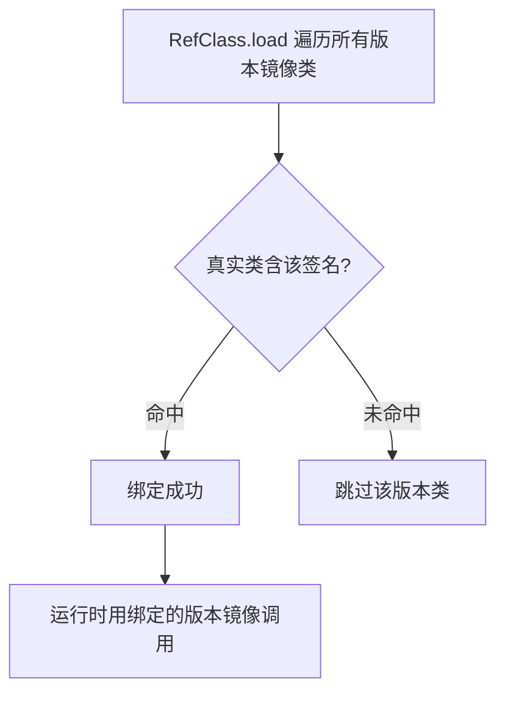

# mirror · IActivityManager

::: tip 源码路径
[`src/main/java/mirror/android/app/IActivityManager.java`](https://github.com/android-security-engineer/VirtualXposed-skills/blob/vxp/VirtualApp/lib/src/main/java/mirror/android/app/IActivityManager.java)
:::

镜像真实接口 `android.app.IActivityManager`。由于该接口的方法签名随 Android 版本变化，VirtualXposed 用**主类 + 版本子类**模式承载：主类放通用方法，每个版本子类放该版本独有的方法签名。

## 主类 IActivityManager（通用方法）

从源码提取的真实镜像成员：

| 成员 | 类型 | 说明 |
| --- | --- | --- |
| `TYPE` | Class | `RefClass.load(IActivityManager.class, "android.app.IActivityManager")` |
| `getTaskForActivity` | RefMethod&lt;Integer&gt; | 查 Activity 所在 task |
| `setRequestedOrientation` | RefMethod&lt;Void&gt; | 设屏幕方向 |
| `overridePendingTransition` | RefMethod&lt;Void&gt; | 转场动画 |
| `startActivity` | RefMethod&lt;Integer&gt; | 启动 Activity |
| `startActivities` | RefMethod&lt;Integer&gt; | 批量启动 |

### 内嵌 ContentProviderHolder

`ContentProviderHolder` 是 `IActivityManager` 的内嵌静态类，独立镜像：

| 成员 | 类型 | 说明 |
| --- | --- | --- |
| `info` | RefObject&lt;ProviderInfo&gt; | CP info |
| `provider` | RefObject&lt;IInterface&gt; | CP 的 IBinder 接口 |
| `noReleaseNeeded` | RefBoolean | 是否免释放标记 |

## 版本子类（finishActivity 签名演变）

`finishActivity` 在不同 API 版本签名不同，故各版本独立镜像类：

| 子类 | 对应 API | 成员 |
| --- | --- | --- |
| [`IActivityManagerICS`](https://github.com/android-security-engineer/VirtualXposed-skills/blob/vxp/VirtualApp/lib/src/main/java/mirror/android/app/IActivityManagerICS.java) | API 14+ | `finishActivity`（RefMethod&lt;Boolean&gt;） |
| [`IActivityManagerL`](https://github.com/android-security-engineer/VirtualXposed-skills/blob/vxp/VirtualApp/lib/src/main/java/mirror/android/app/IActivityManagerL.java) | API 21+ | `finishActivity`（RefMethod&lt;Boolean&gt;） |
| [`IActivityManagerN`](https://github.com/android-security-engineer/VirtualXposed-skills/blob/vxp/VirtualApp/lib/src/main/java/mirror/android/app/IActivityManagerN.java) | API 24+ | `finishActivity`（RefMethod&lt;Boolean&gt;） |

三版本子类都只含 `finishActivity`——其他方法签名稳定放在主类，只有 `finishActivity` 参数随版本变化需独立承载。

## 多版本绑定决策

`RefClass.load` 会尝试所有版本子类，只有签名匹配真实类的才绑定成功——运行时调用 `finishActivity` 会自动命中当前系统对应的版本镜像。

## 真实类与使用方

镜像的真实类为 `android.app.IActivityManager`（@hide 隐藏 API），被以下模块引用：

| 使用方 | 模块 |
| --- | --- |
| `am/MethodProxies.java` | [am 代理](/reference/proxies/am) |
| `am/HCallbackStub.java` | [am 代理](/reference/proxies/am) |
| `am/ActivityManagerStub.java` | [am 代理](/reference/proxies/am) |
| `am/ActivityStack.java` | [server/am](/reference/server/am) |

详见 [反射框架 mirror](/features/mirror-reflection) 与 [mirror 总览](/reference/mirror/)。
