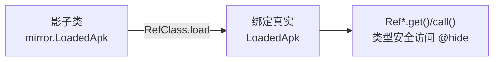

# mirror · LoadedApk

::: tip 源码路径
[`src/main/java/mirror/android/app/LoadedApk.java`](https://github.com/android-security-engineer/VirtualXposed-skills/blob/vxp/VirtualApp/lib/src/main/java/mirror/android/app/LoadedApk.java)
:::

镜像真实类 `android.app.LoadedApk`，用 Ref 引用对象包装其隐藏成员。

## 镜像的字段/方法

  - public static RefObject&lt;ApplicationInfo&gt; mApplicationInfo
  - public static RefMethod&lt;Application&gt; makeApplication
  - public static RefMethod&lt;IServiceConnection&gt; getServiceDispatcher
  - public static RefMethod&lt;IServiceConnection&gt; forgetServiceDispatcher
  - public static RefMethod&lt;ClassLoader&gt; getClassLoader
  - public static RefMethod&lt;IInterface&gt; getIIntentReceiver
  - public static RefObject&lt;BroadcastReceiver&gt; mReceiver
  - public static RefObject&lt;IIntentReceiver&gt; mIIntentReceiver
  - public static RefObject&lt;WeakReference&gt; mDispatcher
  - public static RefObject&lt;ServiceConnection&gt; mConnection
  - public static RefObject&lt;Context&gt; mContext
  - public static RefObject&lt;WeakReference&gt; mDispatcher

## 用途

配合 `RefClass.load` 在运行时绑定到真实 Android 类的对应成员，让 VirtualXposed 以类型安全方式访问这些隐藏 API。详见 [反射框架 mirror](/features/mirror-reflection) 与 [mirror 总览](/reference/mirror/).

## 真实类与使用方

镜像的真实类为 `android.app.LoadedApk`（@hide 隐藏 API），被以下模块引用：

| 使用方 | 模块 |
| --- | --- |
| `am/MethodProxies.java` | [am 代理](/reference/proxies/am) |
| `am/BroadcastSystem.java` | [server/am](/reference/server/am) |
## 镜像绑定与访问

